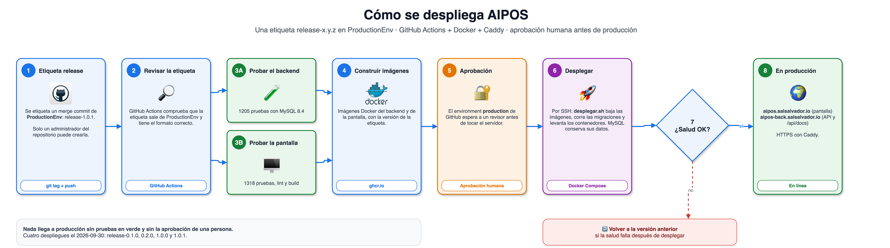
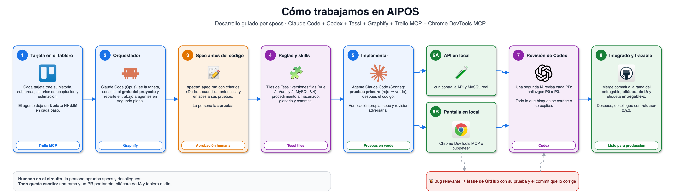

# AIPOS

AIPOS es una aplicación web de una sola pantalla para un punto de venta básico: el cajero crea y busca productos, arma la
venta actual y la registra en MySQL con un procedimiento almacenado (una función guardada dentro de MySQL que la app
llama por su nombre). Es la solución de una prueba técnica y se construyó con agentes de código.

| Qué | Dónde |
|---|---|
| Pantalla | <https://aipos.salsalvador.io> |
| API (el backend) | <https://aipos-back.salsalvador.io> |
| Documentación de la API (Swagger UI) | <https://aipos-back.salsalvador.io/api/docs> |
| Versión desplegada | la etiqueta `release-*` más reciente (hoy, `release-1.0.1`) |
| Código | <https://github.com/g14wx/AIPOS>, rama `ProductionEnv` (donde se juntan los entregables terminados) |

## 1. Tecnologías y versiones

Las versiones van fijas: son las que instala `npm ci` según cada `package-lock.json`. Node está en `.nvmrc` y MySQL en
`docker-compose.yml`. Vue 2 y Vuetify 2 ya no tienen soporte, pero la prueba técnica los pide.

| Parte | Tecnología | Versión |
|---|---|---|
| Backend y pantalla | Node.js | 24 |
| Backend | Express | 5.2.1 |
| Backend | Sequelize | 6.37.8 |
| Backend | sequelize-cli (migraciones) | 6.6.5 |
| Backend | mysql2 | 3.24.5 |
| Backend | helmet y cors | 8.3.0 y 2.8.6 |
| Backend | Swagger UI (swagger-ui-express) | 5.0.1 |
| Base de datos | MySQL | 8.4 |
| Frontend | Vue | 2.7.16 |
| Frontend | Vuetify | 2.7.2 |
| Frontend | Axios | 1.20.0 |
| Frontend | Vite | 7.3.6 |
| Frontend | lottie-web (animaciones) | 5.13.0 |
| Pruebas | Vitest | 5.0.2 |
| Pruebas | Supertest y @vue/test-utils | 7.3.0 y 1.3.6 |
| Calidad | ESLint y Prettier | 10.11.0 y 3.9.9 |
| Contenedores | Docker con Compose v2 | Compose v2 |
| Contenedores | Imágenes base | `node:24-alpine`, `nginxinc/nginx-unprivileged:1.28-alpine` y `mysql:8.4` |
| Producción | Caddy (HTTPS) | 2 |
| Despliegue | GitHub Actions | workflow `despliegue.yml` |

## 2. Instalación y ejecución

Dos caminos: todo con Docker, en unos minutos, o sin Docker, con Node y MySQL instalados en tu máquina.

### Inicio rápido con Docker

Necesitas Git y Docker con Compose v2 (`docker compose version` tiene que responder).

```bash
# 1. Clona el repositorio (abre en ProductionEnv, la versión final).
git clone https://github.com/g14wx/AIPOS.git
cd AIPOS

# 2. Variables de entorno. La pantalla de Docker queda en 127.0.0.1:8141 y tiene que estar en CORS_ORIGIN.
cp .env.example .env
sed -i.bak 's#^CORS_ORIGIN=.*#CORS_ORIGIN=http://127.0.0.1:8141,http://localhost:5173#' .env

# 3. Construye las imágenes de la API y de la pantalla.
docker build -t ghcr.io/g14wx/aipos-backend:local backend
docker build --build-arg VITE_API_URL=http://127.0.0.1:8140 -t ghcr.io/g14wx/aipos-frontend:local frontend

# 4. Levanta MySQL, crea las tablas y el procedimiento, y arranca la API y la pantalla.
export AIPOS_VERSION=local
docker compose -f docker-compose.produccion.yml up -d --wait mysql
docker compose -f docker-compose.produccion.yml run --rm backend npm run migrar
docker compose -f docker-compose.produccion.yml up -d --wait
```

Listo: la pantalla en <http://127.0.0.1:8141>, la API en <http://127.0.0.1:8140/api/salud> y su documentación en
<http://127.0.0.1:8140/api/docs>. La base empieza vacía: crea un producto con «Nuevo producto».
Para apagar: `docker compose -f docker-compose.produccion.yml down` (con `-v` borra también los datos).

### Sin Docker, paso a paso

Necesitas Git, Node.js 24 (`node --version`; con [nvm](https://github.com/nvm-sh/nvm), `nvm install` y `nvm use`) y
MySQL 8.4 corriendo en tu máquina.

1. Clona el repositorio:

   ```bash
   git clone https://github.com/g14wx/AIPOS.git
   cd AIPOS
   ```

2. Crea las bases y el usuario de la app. Entra con `mysql -u root -p` y corre esto. La clave es la de `.env.example`;
   si usas otra, cámbiala también en `.env`:

   ```sql
   CREATE DATABASE aipos CHARACTER SET utf8mb4 COLLATE utf8mb4_0900_ai_ci;
   CREATE DATABASE aipos_prueba CHARACTER SET utf8mb4 COLLATE utf8mb4_0900_ai_ci;
   CREATE USER 'aipos'@'localhost' IDENTIFIED BY 'cambiar-esta-clave';
   GRANT ALL PRIVILEGES ON aipos.* TO 'aipos'@'localhost';
   GRANT ALL PRIVILEGES ON aipos_prueba.* TO 'aipos'@'localhost';
   ```

3. Copia las variables de entorno. El `.env` no va a git.

   ```bash
   cp .env.example .env
   ```

4. Instala la API, crea las tablas y el procedimiento almacenado, y arráncala:

   ```bash
   cd backend
   npm ci
   npm run migrar
   npm start
   ```

5. En otra terminal, desde la raíz, instala la pantalla y arráncala:

   ```bash
   cd frontend
   npm ci
   npm run dev
   ```

6. Abre <http://localhost:5173>. Para comprobar la API: `curl http://localhost:3000/api/salud` responde
   `{"estado":"ok","baseDeDatos":"ok"}`. La documentación de la API está en <http://localhost:3000/api/docs>.

¿Tienes Docker y solo quieres MySQL en un contenedor? Cambia el paso 2 por `docker compose up -d --wait mysql` y sigue
igual.

### Pruebas

```bash
# Backend, desde backend/. La primera vez, con MySQL en Docker, crea la base de prueba (sin Docker ya la creaste en el paso 2).
npm run preparar-prueba
npm test
npm run lint

# Frontend, desde frontend/.
npm test
npm run lint
npm run build

# Pruebas de shell, desde la raíz. Una falla imprime FALLÓ con el nombre del archivo, y el comando termina con código 1.
fallas=0; for prueba in $(find tests -name '*.test.sh' | sort); do bash "$prueba" || { echo "FALLÓ: $prueba"; fallas=$((fallas + 1)); }; done; echo "Fallaron: $fallas"; [ "$fallas" -eq 0 ]
```

`tests/despliegue/arranque-local.test.sh` construye las imágenes de Docker: si Docker no está corriendo, se omite y lo dice.

### Despliegue (agregado: la prueba no lo pide)



*Una etiqueta `release-*` prueba, construye y despliega con Docker, pero solo después de que una persona aprueba.
[Fuente editable](docs/diagramas/proceso-de-despliegue.drawio).*


Una etiqueta `release-MAYOR.MENOR.PARCHE` en un commit de `ProductionEnv` arranca un pipeline de GitHub Actions. Revisa la
etiqueta, prueba el backend y la pantalla, construye las imágenes y espera la aprobación de la persona desarrolladora
(**Review deployments**). Después despliega por SSH (una conexión segura al servidor) y revisa la salud desde internet.

```bash
git tag release-0.1.0 origin/ProductionEnv && git push origin release-0.1.0
```

- **Volver a la versión anterior:** si la salud falla, el servidor vuelve solo. A mano, corre otra vez el workflow de una etiqueta anterior (**Re-run all jobs**) o `desplegar.sh volver` en el servidor.
- **Los datos de producción nunca se borran:** el volumen de MySQL se conserva entre despliegues.

Las etiquetas `release-0.1.0`, `release-0.2.0`, `release-1.0.0` y `release-1.0.1` desplegaron el entregable base, el de
productos, el de ventas y las correcciones de la tarjeta F-01. La guía completa está en [docs/despliegue.md](docs/despliegue.md).

## 3. Funcionalidades

Todo pasa en una sola pantalla: el botón «Nuevo producto», el buscador, la venta actual con su total y «Registrar venta».

- **Crear producto:** nombre, precio (mayor que 0 y hasta 99 999.99, con 2 decimales) y código de barras único. Uno repetido da un error 409.
- **Buscar producto:** por una parte del nombre o por el código de barras exacto, desde 2 caracteres y con 20 resultados como máximo.
- **Agregar a la venta actual:** elegir un resultado lo agrega con cantidad 1, y si ya estaba, la cantidad sube en 1. Un código de barras completo y Enter lo agregan directo.
- **Editar la venta actual:** el precio aplicado, la cantidad (un entero de 1 a 999) y eliminar un detalle, con el subtotal y el total siempre al día. Una venta tiene 100 detalles como máximo, y la venta actual se guarda en el navegador: al recargar, sigue ahí.
- **Registrar venta:** llama al procedimiento `sp_registrar_venta` (punto 7), que guarda la venta con todos sus detalles o no guarda nada. La pantalla muestra «Venta N registrada · Total X».

| Ruta | Qué hace | Errores |
|---|---|---|
| `GET /api/salud` | Dice si la API y MySQL responden. | 500 si MySQL no responde |
| `GET /api/productos?busqueda=` | Buscar producto. | 400 |
| `POST /api/productos` | Crear producto. | 400, 409 |
| `POST /api/ventas` | Registrar venta. | 400, 422 |
| `GET /api/docs` | La documentación de la API, con Swagger UI. | — |

Los errores tienen siempre la misma forma, `{ "error": { "codigo", "mensaje", "detalles" } }` (el formato de error), con un
estado 400 (datos inválidos), 404 (la ruta no existe), 409 (código de barras repetido), 422 (el procedimiento rechazó la
venta por una regla de negocio) o 500 (error inesperado). `backend/docs/openapi.yaml` describe cada ruta.

## 4. Estructura

```text
AIPOS/
├── frontend/                       la pantalla: Vue 2, Vuetify 2 y Vite
│   └── src/                        components/ (uno por parte de la pantalla), api/ (lo único que llama a la API), ventaActual/
├── backend/                        la API: Node.js, Express y Sequelize
│   ├── src/                        las capas, en orden: routes/, controllers/ (con validators/), services/ y models/
│   └── db/                         migrations/ (las tablas y el procedimiento) y procedimientos/ (el .sql)
├── docker-compose.yml              MySQL 8.4 para desarrollo y pruebas
├── docker-compose.produccion.yml   MySQL, backend y pantalla en producción
├── despliegue/                     scripts del servidor y bloques de Caddy (el programa que recibe el tráfico de internet)
├── .github/workflows/              el pipeline de despliegue (la cadena de pasos automáticos de GitHub Actions)
├── docs/                           bitácora de IA, glosario, guías de instalación y diagramas
├── requerimientos/                 requerimientos, flujos y diagramas BPMN (dibujos de un proceso)
├── specs/                          qué tiene que hacer cada parte
├── tests/                          pruebas de shell de la raíz
├── tessl-plugins/                  los tiles de Tessl: reglas y skills del agente
├── graphify-out/                   el grafo del proyecto, el mapa de archivos y funciones que consulta el agente
├── .env.example                    las variables de entorno, con valores de ejemplo
└── AGENTS.md                       las instrucciones para el agente
```

Las capas del backend y los patrones de diseño elegidos están en `specs/arquitectura.spec.md`.

## 5. Cumplimiento de requisitos

Cada fila es un requisito de la prueba técnica. Los RF (requerimientos funcionales) y los RNF (no funcionales) están en
`requerimientos/`, con las tarjetas del [tablero AIPOS](https://trello.com/b/K5mkgcdl/aipos), el tablero de Trello del
proyecto. El estado es Cumplido, Parcial o No completado.

Un entregable es una parte del trabajo que va en su propia rama (base, productos y ventas). Un PR (pull request) es la
solicitud en GitHub para unir una rama con otra, y un merge commit es el commit que las une y deja ver en el historial que
existieron por separado.

| Requisito | Estado | Dónde se ve |
|---|---|---|
| Una sola pantalla con frontend, backend y base de datos (RNF-01) | Cumplido | `frontend/src/App.vue`, <https://aipos.salsalvador.io> |
| Crear producto con nombre, precio y código de barras, desde un botón visible (RF-01) | Cumplido | `frontend/src/components/FormularioProducto.vue`, `POST /api/productos` |
| Buscar producto por nombre o por código de barras (RF-02), y agregarlo con un código exacto y Enter (RF-12, opcional) | Cumplido | `frontend/src/components/BuscadorProductos.vue`, `GET /api/productos?busqueda=` |
| Agregar a la venta actual (RF-03), ver sus detalles (RF-04), editar el precio aplicado (RF-05), cambiar la cantidad (RF-06, recomendado), eliminar un detalle (RF-07) y ver el total (RF-08) | Cumplido | `frontend/src/ventaActual/ventaActual.js`, `frontend/src/components/VentaActual.vue` |
| Registrar venta en MySQL con todos sus detalles (RF-09) | Cumplido | `frontend/src/components/RegistrarVenta.vue`, `POST /api/ventas` |
| Tablas de productos, ventas y detalles de venta, con sus relaciones (RF-10) | Cumplido | `backend/db/migrations/` |
| Un procedimiento almacenado que la app usa de verdad (RF-11) | Cumplido | `sp_registrar_venta`, punto 7 |
| Validación en tres lugares y seguridad básica (RNF-03, RNF-04) | Cumplido | la pantalla, la API (`backend/src/validators/`) y las restricciones de MySQL (`backend/db/migrations/`) |
| Manejo de errores con un solo formato (RNF-05) | Parcial | `backend/src/middlewares/errorHandler.js`; la excepción está en el punto 12 |
| Tecnologías pedidas: Node.js, Express y Sequelize; Vue 2, Vuetify y Axios; MySQL | Cumplido | punto 1 |
| Repositorio público, con una rama por entregable integrada en `ProductionEnv` con merge commit | Cumplido | `git log --graph --first-parent origin/ProductionEnv` y las etiquetas `entregable-*` |
| Uso de inteligencia artificial documentado | Parcial | `docs/bitacora-ia.md` tiene una entrada por tarea, pero lo que la persona revisó de cada una está «por confirmar» |
| README de 12 puntos (RNF-11) | Cumplido | este archivo y `tests/documentacion/readme-entrega.test.sh` |
| Instrucciones que funcionan desde un clon limpio (RNF-07) | Cumplido | la tarjeta E-03 siguió el punto 2 en un clon limpio, con Node 24 y con Node 26 (`docs/bitacora-ia.md`) |

### Lo que agregamos y la prueba técnica no pide

| Qué | Por qué | Dónde se ve |
|---|---|---|
| Documentación de la API con Swagger UI | La pidió la persona desarrolladora el 2026-09-30. Describe cada ruta y se puede probar desde la página. | `GET /api/docs`, `backend/docs/openapi.yaml` |
| Despliegue con etiquetas `release-*` | AIPOS se puede ver funcionando, y si algo falla vuelve a la versión anterior. | `.github/workflows/despliegue.yml`, `docs/despliegue.md` |
| Venta actual guardada en el navegador (`localStorage`) | Decisión de la persona del 2026-09-30: al recargar no se pierde. | `frontend/src/ventaActual/almacenamiento.js` |
| Máximo de 100 detalles por venta | Con 101 detalles, el total no cabría en `DECIMAL(12,2)` y daría un error 500. Lo decidió el orquestador (el agente que coordinaba la jornada); la persona puede confirmarlo o revertirlo. | `backend/src/validators/ventas.js`, `sp_registrar_venta` |
| Docker Compose para MySQL y `GET /api/salud` | Cualquiera levanta la misma base con un comando, y Docker y el pipeline saben si la API responde. | `docker-compose.yml`, `backend/src/routes/salud.js` |
| Proceso de trabajo con agentes: requerimientos con diagramas BPMN, specs, tiles de Tessl y grafo del proyecto | El trabajo se puede seguir paso a paso. | `requerimientos/`, `specs/`, `tessl-plugins/` |

### Lo que no se completó

- **Productos de ejemplo.** No hay un seeder (datos de ejemplo que se cargan con un comando): la base empieza vacía y el cajero crea los productos.
- **Integrar la versión final en `main`.** El PR #104 (de `ProductionEnv` a `main`) queda abierto y lo integra la persona desarrolladora: la regla «Protect main» de GitHub solo deja squash o rebase, y eso pierde los merge commits. La rama por defecto es `ProductionEnv`.
- **Revisión de la persona desarrolladora.** El 2026-09-30, a las 01:40 y a las 01:45, dio su visto bueno general al proceso y a todos los PR, antes de ver el código. Su revisión de cada spec, tarjeta y PR queda «por confirmar» en la bitácora.
- **Diagramas BPMN de los flujos 03 y 04.** No muestran el máximo de 100 detalles por venta. El texto de los dos flujos sí, y manda el texto.
- **Bugs abiertos.** Son issues de GitHub: <https://github.com/g14wx/AIPOS/issues?q=is%3Aissue+is%3Aopen+label%3Abug>.
- **Fuera de alcance, como dice la prueba:** impresión de tickets, generación de documentos, reportes, inventarios, control de caja, métodos de pago, autenticación y CRUD completo (crear, leer, editar y borrar).

## 6. Base de datos MySQL

AIPOS guarda sus datos en MySQL 8.4, que corre con Docker Compose. Las tablas y el procedimiento almacenado se crean solo
con migraciones de Sequelize (archivos que cambian la base de datos paso a paso): Docker solo levanta MySQL. Hace falta
MySQL 8.0.16 o más para que aplique las restricciones `CHECK` (reglas que revisa en cada fila que se guarda).

| Tabla | Columnas | Lo que protege MySQL |
|---|---|---|
| `productos` | `id`, `nombre`, `precio` `DECIMAL(10,2)` y `codigo_barras` (texto, para no perder los ceros de la izquierda) | `codigo_barras` único. `CHECK`: precio mayor que 0 y hasta 99999.99, y nombre y código de barras no vacíos. |
| `ventas` | `id`, `fecha` (la pone MySQL) y `total` `DECIMAL(12,2)` | — |
| `detalles_venta` | `id`, `venta_id` → `ventas`, `producto_id` → `productos`, `cantidad`, `precio_aplicado` `DECIMAL(10,2)` y `subtotal` `DECIMAL(12,2)` | Un detalle por producto en cada venta. Llaves foráneas con `ON DELETE RESTRICT`: un producto vendido no se borra. `CHECK`: cantidad de 1 a 999 y precio aplicado de 0 a 99999.99. |

El dinero es `DECIMAL`, nunca `FLOAT`. mysql2 lo devuelve como texto (`"25.00"`), y así viaja hasta la pantalla: los
subtotales y el total los calcula MySQL, no JavaScript.

Las migraciones corren en este orden, cada una con `up` y `down`. Nunca se edita una ya aplicada: se crea otra.

1. `backend/db/migrations/20260930133500-crear-productos.js` crea `productos`.
2. `backend/db/migrations/20260930164200-crear-ventas.js` crea `ventas`.
3. `backend/db/migrations/20260930164300-crear-detalles-venta.js` crea `detalles_venta`, con sus llaves foráneas.
4. `backend/db/migrations/20260930172100-crear-sp-registrar-venta.js` crea el procedimiento almacenado (punto 7).

```bash
# Desde backend/
npm run migrar             # aplica las migraciones que faltan
npm run deshacer           # deshace la última
npm run rehacer            # deshace todas y las aplica otra vez (borra los datos de las tablas)
npm run preparar-prueba    # crea la base de prueba (aipos_prueba) y le da permisos al usuario de la app
```

Las variables de entorno están en `.env.example`, en la raíz: `MYSQL_HOST`, `MYSQL_PORT`, `MYSQL_DATABASE`,
`MYSQL_TEST_DATABASE`, `MYSQL_USER`, `MYSQL_PASSWORD` y `MYSQL_ROOT_PASSWORD`. La API entra siempre con el usuario de la
app, y root solo lo usan Docker Compose y `npm run preparar-prueba`.

- `docker compose stop mysql` apaga MySQL y los datos se quedan.
- `docker compose down -v` borra también los datos de esa copia, y los pasos del punto 2 la dejan como un clon limpio.

## 7. Procedimiento almacenado

- **Nombre:** `sp_registrar_venta`
- **Objetivo:** guardar una venta con todos sus detalles de una sola vez. Calcula los subtotales y el total, y devuelve el número de la venta y su total. Es todo o nada: si algo falla, no queda nada guardado.
- **Archivo SQL:** `backend/db/procedimientos/sp_registrar_venta.sql`
- **Cómo se crea:** con la migración `backend/db/migrations/20260930172100-crear-sp-registrar-venta.js`, que corre con `npm run migrar` (punto 2). También con el cliente `mysql`, como se ve abajo.
- **Dónde se usa:** `backend/src/services/ventas.js`, función `registrarVenta`, con `CALL sp_registrar_venta(:detalles)`. La llama el controlador `backend/src/controllers/ventas.js` desde la ruta `POST /api/ventas`, y la pantalla desde `frontend/src/api/ventas.js` cuando el cajero presiona «Registrar venta».

### Cómo funciona

- Recibe un parámetro, `p_detalles`: un arreglo JSON (texto con formato JSON) de 1 a 100 objetos, como `[{ "productoId": 1, "cantidad": 2, "precioAplicado": "22.00" }]`.
- Rechaza con `SIGNAL SQLSTATE '45000'` la primera regla de negocio que falle, y la API responde 422: `VENTA_SIN_DETALLES`, `DEMASIADOS_DETALLES`, `DETALLE_INVALIDO`, `CANTIDAD_FUERA_DE_RANGO`, `PRECIO_FUERA_DE_RANGO`, `PRODUCTO_REPETIDO` y `PRODUCTO_NO_EXISTE`.
- Con `START TRANSACTION` inserta la venta y sus detalles (`JSON_TABLE` lee el JSON como una tabla), calcula cada subtotal con `ROUND(precio_aplicado * cantidad, 2)` y el total, y hace `COMMIT`. Si algo falla, un `EXIT HANDLER` hace `ROLLBACK` y vuelve a lanzar el error con `RESIGNAL`.
- Devuelve un solo `SELECT` con `ventaId` y `total`. La API lo llama sin `sequelize.transaction()`: MySQL no anida transacciones, y el `START TRANSACTION` del procedimiento confirmaría sin avisar lo que la API tuviera abierto.

El `.sql` usa `DELIMITER $$`, un comando del cliente `mysql` que por Sequelize da el error 1064, así que la migración manda
solo el bloque `CREATE PROCEDURE … END`. Con el cliente se corre el archivo entero, con el usuario de la app y nunca con
root: si root crea el procedimiento, la app ya no puede cambiarlo ni borrarlo.

```bash
# Crearlo con el cliente mysql, desde la raíz y con MySQL levantado. El aviso de la clave es de mysql, no un error.
docker compose exec -T mysql sh -c 'mysql -u"$MYSQL_USER" -p"$MYSQL_PASSWORD" "$MYSQL_DATABASE"' < backend/db/procedimientos/sp_registrar_venta.sql

# Probarlo con la API corriendo y un producto creado en la pantalla (en una base nueva es el 1): responde 201 con el número de la venta y el total.
curl -s -X POST http://localhost:3000/api/ventas -H 'Content-Type: application/json' \
  -d '{"detalles":[{"productoId":1,"cantidad":2,"precioAplicado":"22.00"}]}'

# Con un producto que no existe, el procedimiento rechaza la venta: responde 422 con PRODUCTO_NO_EXISTE.
curl -s -X POST http://localhost:3000/api/ventas -H 'Content-Type: application/json' \
  -d '{"detalles":[{"productoId":9999,"cantidad":1,"precioAplicado":"1.00"}]}'
```

Dos pruebas comprueban que el procedimiento se usa de verdad: `backend/tests/ventas/usa-el-procedimiento.test.js` (sin el
procedimiento, registrar una venta responde 500 y no guarda nada) y `backend/tests/base-de-datos/sp-registrar-venta-todo-o-nada.test.js`
(si un detalle falla, no queda ninguna venta ni detalle nuevo).

## 8. Tiempo

El tiempo sale de la bitácora de IA, [`docs/bitacora-ia.md`](docs/bitacora-ia.md): cada entrada dice cuándo empezó y
terminó su tarea. Esta tabla es la de la bitácora, tal cual, y `tests/documentacion/readme-entrega.test.sh` revisa que siga
igual.

| Entregable | Tiempo aprox. | Tareas con agente | Propuestas cambiadas o descartadas | Qué suma |
|---|---|---|---|---|
| Preparación | 11 h 08 min | 34 | 26 | Agentes, tiles y glosario (8 h 37 min), y requerimientos, diagramas BPMN y tablero AIPOS (2 h 31 min) |
| Specs | 10 h, sin la spec de despliegue (sin medir) | 10 | 14 | S-01 (2 h 58 min), S-02 (4 h 33 min) y las 6 specs de flujo |
| Base | 18 h 55 min | 7 | 32 | B-01, B-02, B-03, B-04, A-01 y el PR #70 del entregable |
| D-01 | 5 h 24 min | 1 | 3 | El pipeline de despliegue |
| Productos | 11 h 22 min | 7 | 34 | P-01 a P-05 y el PR #76 del entregable |
| Ventas | 10 h 52 min | 10 | 70 | V-01 a V-08 y el PR #96 del entregable |
| F-01, corrección sin entregable | 1 h 27 min | 1 | 9 | Los issues #58, #59 y #60 del backend |
| Entrega final | 1 h 48 min | 3 | 6 | E-01 (46 min), E-02 (39 min) y E-03 (23 min) |
| Total | 70 h 56 min | 73 | 194 | |

- **Suma y reloj.** El tiempo de cada entregable es la suma de sus tareas, y varias corrieron a la vez. Por eso la suma, 70 h 56 min, es mayor que el reloj: del primer commit (2026-09-29 12:46) a la última hora anotada (2026-09-30 16:15) pasaron 27 h 29 min, con pausas.
- **Estimación.** La inicial, en horas por tarjeta, está en `requerimientos/04-entregables.md`. En las 28 filas con tiempo real de la bitácora, la estimación suma 36 h 30 min y el tiempo real 58 h 13 min: 1,6 veces lo estimado.
- **Entrega final.** A las 15:50 la persona avisó que le quedaba una hora para entregar, y el proceso de E-01, E-02 y E-03 se recortó (lo cuenta la entrada de E-03 en la bitácora).

## 9. Herramientas de IA

Dos agentes trabajaron en el proyecto: Claude Code escribió, y Codex revisó.

| Herramienta | Para qué se usó |
|---|---|
| **Claude Code** (Anthropic) | Escribió el código, las pruebas, las specs, los requerimientos y la documentación. Los modelos salen de la línea `Co-Authored-By` de sus commits: Claude Sonnet 5.5 (las tarjetas, en agentes en segundo plano), Claude Opus 5.5 (planificación, tiles de Tessl, glosario y requerimientos) y Claude Fable 5.1 (la configuración inicial de los agentes, según la bitácora). |
| **Codex** (OpenAI) | El agente revisor. Con `codex review --base <rama de destino>` revisó los PR de las tarjetas y de los entregables, y las specs. Sus hallazgos, de P0 (el más grave) a P3, los corrigió Claude Code o los explicó. No firma commits porque no escribe código. |
| **MCP** (una forma estándar de conectar el agente con herramientas externas) | Trello, para leer y mover las tarjetas del tablero AIPOS; `design-patterns`, un catálogo de patrones de diseño que se consulta antes de cada decisión de diseño; y `chrome-devtools`, para probar la pantalla en el navegador. |
| **Tessl y sus tiles** | Un tile de Tessl es un paquete de reglas y skills para el agente. Los seis del proyecto están en `tessl.json`, y `tessl install` los instala para Claude Code y Codex: `lenguaje-ubicuo` (el glosario), `entrega-trazable` (commits, PR y bitácora), `mysql-sequelize-procedimientos`, `vue2-vuetify2-vite`, `grafo-del-proyecto` y `spec-driven-development` (las specs van antes del código). |
| **Graphify** | Arma el grafo del proyecto, el mapa de archivos y funciones que el agente consulta antes de cada tarea. El hook de git `pre-commit` lo actualiza en cada commit. |
| **Skills del agente** | `impeccable` (diseño de la pantalla), `drawio-skill` (diagramas), `spec-writer`, `spec-verification` y `work-review` (specs), y `bitacora-ia`, `flujo-entregable` y `readme-entrega` (entrega). |

Las guías de instalación están en [docs/setup/agents-setup.md](docs/setup/agents-setup.md) (el MCP de Trello),
[docs/setup/tessl-setup.md](docs/setup/tessl-setup.md) (Tessl y los tiles) y
[docs/setup/graphify-setup.md](docs/setup/graphify-setup.md) (Graphify y el hook de git).

## 10. Cómo se usó el agente



*Cada tarjeta pasa por una spec que la persona aprueba, un agente que la implementa con las pruebas primero y la revisión
de Codex. [Fuente editable](docs/diagramas/proceso-de-trabajo.drawio).*

Claude Code escribió el código, las pruebas, las specs y la documentación, y Codex revisó los PR. La persona desarrolladora
dirigió el trabajo: decidió el alcance y las reglas, y revisó lo que se detalla más abajo.

Cada tarea quedó en la bitácora de IA, [`docs/bitacora-ia.md`](docs/bitacora-ia.md): qué se le pidió al agente, qué hizo,
qué revisó o corrigió la persona, qué propuestas se descartaron, cuánto tardó y qué commits dejó. El proceso está dibujado
arriba («Cómo trabajamos») y escrito en [requerimientos/flujos/06-trabajar-una-tarjeta-con-el-agente.md](requerimientos/flujos/06-trabajar-una-tarjeta-con-el-agente.md).

### Buenas prácticas y lo que haríamos distinto

Lo que sí seguimos:

- **Spec antes del código.** Cada tarjeta de código tuvo una spec con criterios que se pueden comprobar y enlaces a sus pruebas.
- **Reglas en el repositorio.** Los tiles de Tessl fijan versiones y patrones, y el grafo del proyecto dice qué archivos tocar.
- **Pruebas primero y revisión en capas.** Las pruebas van en rojo antes del código, después la prueba en local, y Codex revisa cada PR.

Lo que haríamos distinto:

- **Ajustar el proceso al plazo.** 25 tarjetas con spec, PR, Codex y bitácora costaron más que el código (70 h 56 min de suma de tareas). Preguntaríamos el plazo al empezar y juntaríamos las tarjetas chicas.
- **Revisar antes de integrar.** La persona dio su OK general a la 01:40 y se fue a dormir, y el orquestador integró PR y aprobó despliegues en su nombre. Lo correcto es que la persona revise antes.
- **Menos agentes a la vez.** Con muchos agentes en paralelo se perdieron horas por caídas y cortes. Funcionó mejor tener pocos, cada uno con un archivo de avance.

### Qué se le delegó

- **Requerimientos y tablero.** `requerimientos/` (alcance, requerimientos y siete flujos con diagramas BPMN) y las tarjetas del tablero AIPOS, con sus criterios de aceptación.
- **Reglas y specs.** Los tiles de Tessl (punto 9) y las specs de `specs/`, escritas antes de implementar, con sus pruebas enlazadas.
- **Una tarjeta por agente.** Un agente en segundo plano tomó cada tarjeta de código: escribió primero las pruebas y después el código, lo probó en local (la API con `curl` y la pantalla en el navegador), abrió un issue de GitHub por cada bug relevante y lo cerró con el commit que lo corrige.
- **Verificación y cierre.** El agente comparó su trabajo con la spec, pasó la revisión de Codex, corrigió o explicó cada hallazgo e integró el PR con merge commit.

### Ejemplos de la bitácora

- **La persona corrigió una afirmación falsa del agente (2026-09-29, 12:46; reconstruida, por confirmar).** Claude Code dijo que Codex no admite servidores MCP por proyecto, porque solo había mirado `codex mcp add --help`. La persona comprobó que sí los admite, y quedó en `.codex/config.toml.example`.
- **La persona corrigió cómo habla el agente (2026-09-29, 14:52).** El agente preguntó «¿Quito la línea Claude-Session?» sin decir qué era ni dónde estaba. Eso quedó como regla de comunicación clara en el tile `lenguaje-ubicuo`.
- **Codex vio lo que el agente no vio (tarjeta B-03).** El agente puso un tope de 3 segundos a `GET /api/salud`, pero Codex señaló que la consulta seguía viva después del tope. Se abrió el issue #54 y se corrigió cerrando la conexión cuando vence el tiempo.
- **El agente encontró bugs probando la pantalla (tarjeta B-04).** En Chrome real encontró seis, como el botón de borrar del buscador, que se anunciaba en inglés (issue #42). Abrió un issue por cada uno y los cerró con su commit.

### Qué revisó, corrigió o decidió la persona

- Decidió el alcance y las palabras del glosario («cajero», «venta actual», «crear producto», «precio aplicado», «detalle de venta» y «registrar venta»), aprobó los diagramas y el tablero, y resolvió las preguntas abiertas de los requerimientos el 2026-09-30.
- Entre las 00:40 y las 01:20 del 2026-09-30 dejó las reglas de la noche: las specs se escriben primero, una rama y un PR por tarjeta, y el agente integra los PR si las pruebas pasan y cada hallazgo de Codex queda corregido o explicado. El PR de `ProductionEnv` a `main` lo integra la persona.
- **Por confirmar.** A las 01:40 y a las 01:45 del 2026-09-30 dio su visto bueno a todo el proceso y a todos los PR, antes de ver las specs y el código. Por eso la bitácora dice «por confirmar» en su revisión de esas tareas: las propuestas que el agente cambió o descartó las decidió el agente, y la persona puede confirmarlas o revertirlas.

## 11. Decisiones técnicas

Salen de «Propuestas cambiadas o descartadas» de la bitácora y de los requerimientos. La columna del medio dice qué propuso
el agente, o Codex, cuando la decisión fue distinta. Donde dice «el agente», la persona desarrolladora todavía tiene que
confirmarla. Cada spec anota además el patrón de diseño elegido del catálogo `design-patterns` (por ejemplo, Layered
Architecture para las capas del backend y Facade para `frontend/src/api/`: `specs/arquitectura.spec.md`).

| Decisión | Propuesta original (si vino del agente) | Motivo |
|---|---|---|
| Los commits no llevan la línea `Claude-Session` ni enlaces a sesiones del agente. Decidió la persona, el 2026-09-29. | El agente la ponía en cada commit, como pide su configuración. | El repositorio es público, y quien evalúe puede no tener acceso a ese enlace. |
| Un PR por tarjeta hacia la rama de su entregable, y otro del entregable hacia `ProductionEnv`. Pidió la persona, a las 01:12 del 2026-09-30. | Un solo PR por entregable. | Cada PR pasa por la revisión de Codex, y `git log --graph` muestra un merge commit por entregable y, dentro, uno por tarjeta (RNF-09). |
| Se apagaron los PR de seguridad automáticos de Dependabot, y las alertas de Vue 2 y Vuetify 2 se revisan a mano. Decidió la persona, el 2026-09-29. | El agente dijo que `ignore` en `.github/dependabot.yml` también frenaba los PR de seguridad. | No los frenó: Dependabot abrió PR que subían Vue y Vuetify a la versión 3, y la prueba exige la 2. |
| Express 5.2.1, y un 422 para el `SIGNAL SQLSTATE '45000'` del procedimiento. El 2026-09-29 la persona decidió actualizar el tile para alinearlo con los requerimientos. | El tile `mysql-sequelize-procedimientos` asumía Express 4 y respuestas 400 y 409. | Mandan los requerimientos sobre el tile. Express 5 pasa al manejador de errores los errores de las funciones `async`. |
| El `.sql` del procedimiento lleva `DELIMITER $$`, y la migración manda solo el bloque `CREATE PROCEDURE … END`. El 2026-09-29 la persona decidió actualizar el tile. | Un `.sql` sin `DELIMITER`, como decía el tile. | `DELIMITER` es un comando del cliente `mysql` y por Sequelize da el error 1064. Así el mismo archivo corre con el cliente y con la migración. |
| El dinero viaja como texto, y los subtotales y el total los calcula MySQL. Lo fijan la arquitectura y el tile. | — | mysql2 devuelve `DECIMAL` como texto, y en JavaScript 0.1 + 0.2 da 0.30000000000000004. |
| `DECIMAL(12,2)` para el subtotal y el total, y `DECIMAL(10,2)` para el precio y el precio aplicado. Decidió el agente. | `DECIMAL(10,2)` en todo, como pedía el tile. | Con 100 detalles de 999 unidades a 99 999.99, el total llega a 9 989 999 001.00 y no cabe en `DECIMAL(10,2)`. |
| Una venta tiene como máximo 100 detalles. Decidió el orquestador, con el consentimiento general de la persona, que puede confirmarlo o revertirlo. | Sin límite, ampliando `ventas.total` a `DECIMAL(14,2)`. | Con 101 detalles el total pasaría de `DECIMAL(12,2)` y daría un error 500. |
| La venta actual se guarda en el navegador (`localStorage`). Decidió la persona, el 2026-09-30. | Que se pierda al recargar la página. | Recargar ya no pierde la venta actual (pregunta abierta 2 de `requerimientos/README.md`). |

## 12. Consideraciones

### Para ejecutar

- **Versiones.** Node 24 (`.nvmrc`), Docker con Compose v2 y MySQL 8.4. Con un MySQL anterior a 8.0.16, MySQL no aplica las restricciones `CHECK`. Nunca `mysql:latest` ni una 9.x: Sequelize 6 soporta MySQL 5.7 y 8.
- **El `.env`.** Está en la raíz y lo leen el backend y la pantalla. Si falta una variable obligatoria o `CORS_ORIGIN` está mal escrito (sin esquema, con barra final o con `*`), la API no arranca y dice cuál. Las claves que empiezan con «cambiar-» son de ejemplo: hay que cambiarlas.
- **Puertos.** Si uno está ocupado, cambia `MYSQL_PORT`, `PORT` o `FRONTEND_PORT` en el `.env`, y con ellos `CORS_ORIGIN` y `VITE_API_URL`. Para tener dos copias a la vez, cambia también `COMPOSE_PROJECT_NAME`.
- **Avisos que no son errores.** npm avisa al instalar (`npm warn install-scripts` y el resumen de `npm audit`), las pruebas de la pantalla imprimen «Not implemented: HTMLCanvasElement's getContext()» (un aviso de jsdom por la animación) y el build avisa «Some chunks are larger than 500 kB».

### Trampas conocidas

- `npm i vuetify` y `npm i vite` instalan versiones que no funcionan con Vue 2: por eso las versiones van fijas (punto 1).
- `DECIMAL` sin tamaño se vuelve `DECIMAL(10,0)` y pierde los centavos. mysql2 devuelve `DECIMAL` como texto, y «25.00» + «22.00» pega los textos en vez de sumar: por eso el dinero es texto en JavaScript y se calcula en SQL.
- `DELIMITER` no se puede mandar por Sequelize (error 1064), y un procedimiento que crea root no lo puede cambiar ni borrar el usuario de la app (punto 7).

### Limitaciones y lo que falta

- **Vue 2 y Vuetify 2 ya no reciben correcciones.** `npm audit` avisa de `vue` 2 (un ReDoS: una expresión regular que puede tardar demasiado), de `vue-template-compiler` (XSS: código malicioso que se cuela en una página) y de `uuid` en `sequelize` 6.37.8. Arreglarlos exige Vue 3 o Sequelize 3, y la prueba lo impide. La pantalla no usa `v-html` con datos del cajero, y la API usa consultas parametrizadas.
- **Reintentar puede repetir una venta.** Si se pierde la respuesta de «Registrar venta», la pantalla avisa y conserva la venta actual. Si MySQL ya la había guardado, al reintentar queda repetida: no hay una llave de idempotencia. Un doble clic sí registra una sola.
- **Errores que contesta Node.** Unos pocos errores del cliente, como una petición mal formada o de un cliente lento, los contesta Node antes de que lleguen a Express y no tienen el formato de error (issue #97, abierto).
- **Grafo del proyecto.** No se probó en Windows y allí necesita Git Bash (issues #20 y #21). Integrar un PR con el botón de GitHub no actualiza el grafo (issue #22): hay que poner la rama al día en local antes.
- **Sin autenticación.** La prueba no la pide: quien tiene la pantalla abierta es el cajero.
