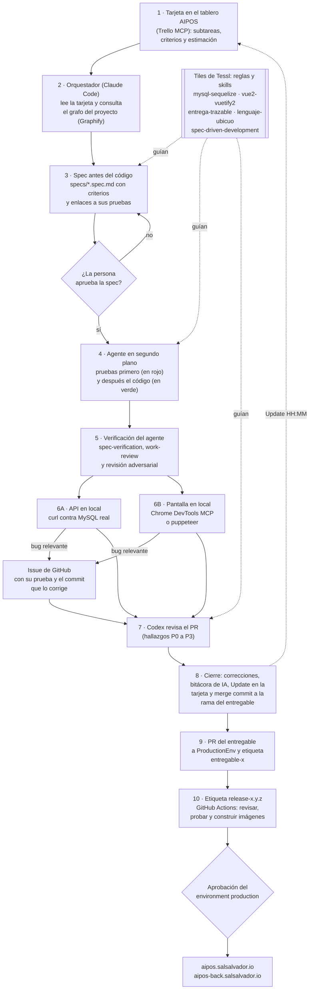

# AIPOS

AIPOS es una aplicación web de una sola pantalla para un punto de venta básico. El cajero crea y busca productos, arma
la venta actual y la registra en MySQL con un procedimiento almacenado (una función guardada dentro de MySQL que la
app llama por su nombre). Es la solución de una prueba técnica y se construyó con agentes de código.

| Qué | Dónde |
|---|---|
| Pantalla | <https://aipos.salsalvador.io> |
| API (el backend) | <https://aipos-back.salsalvador.io> |
| Documentación de la API (Swagger UI) | <https://aipos-back.salsalvador.io/api/docs> |
| Versión desplegada | la etiqueta `release-*` más reciente (al escribir este README, `release-1.0.1`) |
| Código | <https://github.com/g14wx/AIPOS>, rama `ProductionEnv` (la rama donde se juntan los entregables terminados) |

Este README tiene los 12 puntos que pide la prueba. Cada dato se puede comprobar en el repositorio, y la prueba
`tests/documentacion/readme-entrega.test.sh` revisa que estén los 12 puntos, que las versiones sean las instaladas y que
los archivos y los comandos que se nombran existan.

1. [Funcionalidades](#1-funcionalidades)
2. [Tecnologías y versiones](#2-tecnologías-y-versiones)
3. [Estructura](#3-estructura)
4. [Cumplimiento de requisitos](#4-cumplimiento-de-requisitos)
5. [Instalación y ejecución](#5-instalación-y-ejecución)
6. [Base de datos MySQL](#6-base-de-datos-mysql)
7. [Procedimiento almacenado](#7-procedimiento-almacenado)
8. [Tiempo](#8-tiempo)
9. [Herramientas de IA](#9-herramientas-de-ia)
10. [Cómo se usó el agente](#10-cómo-se-usó-el-agente)
11. [Decisiones técnicas](#11-decisiones-técnicas)
12. [Consideraciones](#12-consideraciones)

## 1. Funcionalidades

Todo pasa en una sola pantalla: el botón «Nuevo producto», el campo de búsqueda con sus resultados, la venta actual con
su total y el botón «Registrar venta».

- **Crear producto.** El botón «Nuevo producto» abre un formulario con nombre, precio y código de barras. La pantalla, la
  API y MySQL validan los datos: el precio es mayor que 0 y llega hasta 99 999.99, con 2 decimales como máximo. Un código
  de barras repetido da un error 409, y la pantalla lo dice junto al campo sin borrar lo que el cajero escribió.
- **Buscar producto.** Por una parte del nombre, sin importar mayúsculas, o por el código de barras exacto. Busca desde 2
  caracteres y muestra 20 resultados como máximo. Si el cajero escribe rápido, solo se ven los resultados de lo último
  que escribió.
- **Agregar a la venta actual.** Elegir un resultado lo agrega con cantidad 1 y con un precio aplicado igual al precio del
  producto. Si ya estaba, su cantidad sube en 1. Si el cajero escribe un código de barras completo y presiona Enter, el
  producto entra directo, sin elegirlo en la lista.
- **Ver la venta actual.** Cada detalle de la venta actual muestra su nombre, su precio aplicado, su cantidad y su
  subtotal, y abajo está el total, con 2 decimales. La venta actual se guarda en el navegador: si se recarga la página,
  sigue ahí.
- **Editar el precio aplicado, cambiar la cantidad y eliminar detalle.** Editar el precio aplicado no cambia el precio del
  producto. La cantidad es un entero de 1 a 999, y una venta tiene como máximo 100 detalles. Un valor que no sirve queda
  como error de un campo del detalle, y «Registrar venta» se deshabilita hasta corregirlo.
- **Registrar venta.** El botón manda la venta actual a la API, que llama al procedimiento almacenado
  `sp_registrar_venta` (punto 7). Guarda la venta con todos sus detalles de una sola vez, o no guarda nada. La pantalla
  muestra «Venta N registrada · Total X», con el total que calculó MySQL, y deja vacía la venta actual.

### La API

| Ruta | Qué hace | Errores |
|---|---|---|
| `GET /api/salud` | Dice si la API está viva y si MySQL responde. | 500 si MySQL no responde |
| `GET /api/productos?busqueda=` | Buscar producto. | 400 |
| `POST /api/productos` | Crear producto. | 400, 409 |
| `POST /api/ventas` | Registrar venta. | 400, 422 |
| `GET /api/docs` | La documentación de la API, con Swagger UI. | — |

Las respuestas de error de la API tienen la misma forma, `{ "error": { "codigo", "mensaje", "detalles" } }`, y usan uno de
cinco estados: 400 (datos inválidos), 404 (la ruta no existe), 409 (el código de barras ya existe), 422 (el procedimiento
almacenado rechazó la venta por una regla de negocio) y 500 (error inesperado, sin detalles internos para el cliente). La
excepción conocida está en el punto 12. El documento OpenAPI `backend/docs/openapi.yaml` describe cada ruta, y Swagger UI
lo muestra en `/api/docs`.

## 2. Tecnologías y versiones

Las versiones van fijas, sin `^` ni `~`, y son las que instala `npm ci` según cada `package-lock.json`. La prueba del
README las compara con esos archivos.

| Parte | Tecnología | Versión | Dónde se fija |
|---|---|---|---|
| Los dos | Node.js | 24 | `.nvmrc` (los dos `package.json` piden 24 o más) |
| Frontend | Vue | 2.7.16 | `frontend/package-lock.json` |
| Frontend | Vuetify | 2.7.2 | `frontend/package-lock.json`, con su CSS ya compilado |
| Frontend | Axios | 1.20.0 | `frontend/package-lock.json` |
| Frontend | Vite | 7.3.6 | `frontend/package-lock.json`, con `@vitejs/plugin-vue2` 2.3.4 |
| Frontend | lottie-web | 5.13.0 | `frontend/package-lock.json`, para las animaciones |
| Backend | Express | 5.2.1 | `backend/package-lock.json` |
| Backend | Sequelize | 6.37.8 | `backend/package-lock.json`, con `sequelize-cli` 6.6.5 |
| Backend | mysql2 | 3.24.5 | `backend/package-lock.json` |
| Backend | swagger-ui-express | 5.0.1 | `backend/package-lock.json`, para la documentación de la API |
| Base de datos | MySQL | 8.4 | `docker-compose.yml`, imagen `mysql:8.4` |
| Pruebas | Vitest | 5.0.2 | los dos `package-lock.json`, con `supertest` 7.3.0 en el backend y `@vue/test-utils` 1.3.6 en el frontend |
| Calidad | ESLint | 10.11.0 | los dos `package-lock.json`, con Prettier 3.9.9 |

- Las imágenes de Docker del backend y de la pantalla se construyen con `node:24-alpine`, y la pantalla se sirve con
  nginx. MySQL corre con Docker Compose.
- Vue 2 y Vuetify 2 ya no tienen soporte, pero la prueba los exige. Por eso las versiones están fijas: al escribir los
  requerimientos (2026-09-30), `npm i vuetify` instalaba la 4.2.2 y `npm i vite` la 8.3.1, y ninguna funciona con Vue 2.

## 3. Estructura

```text
AIPOS/
├── backend/                       la API: Node.js, Express y Sequelize
├── frontend/                      la pantalla: Vue 2, Vuetify 2 y Vite
├── docker-compose.yml             MySQL 8.4 para desarrollo y pruebas
├── docker-compose.produccion.yml  MySQL, backend y pantalla en producción
├── despliegue/                    scripts del servidor y bloques de Caddy (el programa que recibe el tráfico de internet)
├── .github/workflows/             el pipeline de despliegue (la cadena de pasos automáticos de GitHub Actions)
├── docs/                          la bitácora de IA (qué hizo el agente en cada tarea), el glosario y las guías de instalación
├── requerimientos/                requerimientos, flujos y diagramas BPMN (dibujos de un proceso)
├── specs/                         las specs: qué tiene que hacer cada parte
├── tests/                         pruebas de shell de la raíz
├── tessl-plugins/                 los tiles de Tessl: reglas y skills del agente
├── graphify-out/                  el grafo del proyecto, el mapa de archivos y funciones que consulta el agente
├── .env.example                   las variables de entorno, con valores de ejemplo
├── .nvmrc                         Node 24
└── AGENTS.md                      las instrucciones para el agente
```

### Frontend

- `frontend/src/main.js` y `frontend/src/App.vue` arrancan Vue 2 y arman la pantalla única.
- `frontend/src/components/` tiene un componente por parte de la pantalla: `NuevoProducto.vue` (el botón y el aviso),
  `FormularioProducto.vue` (el formulario, en una ventana encima de la pantalla), `BuscadorProductos.vue`,
  `VentaActual.vue`, `CampoPrecioAplicado.vue`, `CampoCantidad.vue`, `RegistrarVenta.vue` y `AnimacionLottie.vue`.
- `frontend/src/api/` es el único lugar que habla con la API: `http.js` (Axios, con un solo formato de error),
  `productos.js` y `ventas.js`. Ningún componente llama a Axios directo.
- `frontend/src/ventaActual/` tiene la lógica de la venta actual sin pantalla: `ventaActual.js` (agregar, precio
  aplicado, cantidad, eliminar y total), `validaciones.js` y `almacenamiento.js` (la guarda en el navegador).
- `frontend/src/plugins/vuetify.js` define el tema con la paleta, y `frontend/src/assets/animaciones/` tiene las
  animaciones Lottie.
- `frontend/tests/` tiene las pruebas de Vitest, y `frontend/vite.config.js`, `frontend/Dockerfile` y
  `frontend/nginx.conf` arman, construyen y sirven la pantalla.

### Backend

- Las capas van en este orden: rutas, controladores, servicios y modelos. `backend/src/routes/` dice qué ruta llama a qué
  controlador, `backend/src/controllers/` recibe la petición y la valida con `backend/src/validators/`,
  `backend/src/services/` tiene la lógica de negocio y `backend/src/models/` tiene `Producto`, `Venta` y `DetalleVenta`.
- `backend/src/app.js` arma Express: helmet (cabeceras de seguridad), CORS (la regla del navegador que decide qué páginas
  pueden llamar a la API), límite de 100 KB para el cuerpo, las rutas de `/api`, la ruta no encontrada y el manejador de errores. `backend/src/servidor.js` arranca la API: escucha en `PORT` y
  avisa si el puerto está ocupado.
- `backend/src/config.js` es el único archivo que lee las variables de entorno, y `backend/src/database.js` crea la
  conexión de Sequelize. `backend/src/documentacion.js` lee `backend/docs/openapi.yaml`, que `backend/src/routes/docs.js`
  muestra con Swagger UI.
- `backend/src/errors/` (`ErrorApi.js` y `desdeBaseDeDatos.js`, que traduce los errores de MySQL) y
  `backend/src/middlewares/` (`errorHandler.js` y `noEncontrado.js`) dan el formato de error.
- `backend/src/crearServidor.js` crea el servidor HTTP y contesta con el formato de error a una dirección o unas cabeceras
  de más de 16 KB, que Node rechaza antes de que lleguen a Express (issue #60, el aviso del bug en GitHub).
- `backend/src/errors/aFormatoDeError.js` arma el cuerpo del formato de error, para que lo usen el manejador de errores y
  ese servidor.
- `backend/scripts/crear-base-de-prueba.js`, `backend/tests/` y `backend/Dockerfile` completan la carpeta.

### Base de datos

- `docker-compose.yml` levanta MySQL 8.4.
- `backend/db/migrations/` tiene las migraciones: las tres tablas (`productos`, `ventas` y `detalles_venta`) y el
  procedimiento almacenado. Están listadas en el punto 6.
- `backend/db/procedimientos/sp_registrar_venta.sql` es el script SQL del procedimiento almacenado (punto 7).
- `backend/db/config.js` y `backend/.sequelizerc` configuran `sequelize-cli`, la herramienta que corre las migraciones.

## 4. Cumplimiento de requisitos

Cada fila es un requisito de la prueba técnica. Los RF (requerimientos funcionales) y los RNF (no funcionales) están en
`requerimientos/`, con sus criterios de aceptación y las tarjetas del [tablero AIPOS](https://trello.com/b/K5mkgcdl/aipos), el
tablero de Trello del proyecto, que los construyeron. El estado es Cumplido, Parcial o No completado. Un entregable es una
parte del trabajo que se entrega en su propia rama (base, productos y ventas). Un PR (pull request) es la solicitud en GitHub
para unir una rama con otra, y un merge commit es un commit que une dos ramas y deja ver en el historial que existieron por
separado.

| Requisito | Estado | Dónde se ve |
|---|---|---|
| Una sola pantalla con frontend, backend y base de datos (RNF-01) | Cumplido | `frontend/src/App.vue`, <https://aipos.salsalvador.io> |
| Crear producto con nombre, precio y código de barras, desde un botón visible (RF-01) | Cumplido | `frontend/src/components/NuevoProducto.vue`, `frontend/src/components/FormularioProducto.vue`, `POST /api/productos` |
| Buscar producto por nombre o por código de barras (RF-02) | Cumplido | `frontend/src/components/BuscadorProductos.vue`, `GET /api/productos?busqueda=` |
| Agregar a la venta actual (RF-03) y ver sus detalles (RF-04) | Cumplido | `frontend/src/ventaActual/ventaActual.js`, `frontend/src/components/VentaActual.vue` |
| Editar el precio aplicado (RF-05) | Cumplido | `frontend/src/components/CampoPrecioAplicado.vue` |
| Cambiar la cantidad (RF-06, recomendado) | Cumplido | `frontend/src/components/CampoCantidad.vue` |
| Eliminar un producto de la venta actual (RF-07) | Cumplido | botón «Eliminar» de `frontend/src/components/VentaActual.vue` |
| Ver el total (RF-08) | Cumplido | el total, abajo de la venta actual |
| Registrar venta en MySQL con todos sus detalles (RF-09) | Cumplido | `frontend/src/components/RegistrarVenta.vue`, `POST /api/ventas` |
| Tablas de productos, ventas y detalles de venta, con sus relaciones (RF-10) | Cumplido | `backend/db/migrations/` |
| Un procedimiento almacenado que la app usa de verdad (RF-11) | Cumplido | `sp_registrar_venta`, punto 7 |
| Agregar con un código de barras exacto y Enter (RF-12, opcional) | Cumplido | `frontend/src/components/BuscadorProductos.vue` |
| Validación en tres lugares y seguridad básica (RNF-03, RNF-04) | Cumplido | pantalla, API (`backend/src/validators/`) y restricciones de MySQL (`backend/db/migrations/`) |
| Manejo de errores con un solo formato (RNF-05) | Parcial | `backend/src/middlewares/errorHandler.js`; la excepción conocida está en el punto 12 |
| Tecnologías: Node.js, Express y Sequelize; Vue 2, Vuetify y Axios; MySQL | Cumplido | punto 2 |
| Repositorio público con frontend, backend, migraciones y el script del procedimiento | Cumplido | este repositorio |
| Ramas por entregable integradas en `ProductionEnv` con merge commit, y commits claros | Cumplido | `git log --graph --first-parent origin/ProductionEnv`, y las etiquetas `entregable-base`, `entregable-productos` y `entregable-ventas` |
| Uso de inteligencia artificial documentado | Parcial | `docs/bitacora-ia.md` tiene una entrada por tarea, pero lo que la persona revisó de cada una está «por confirmar» (puntos 10 y 12) |
| README de 12 puntos (RNF-11) | Cumplido | este archivo, y `tests/documentacion/readme-entrega.test.sh` |
| Instrucciones que funcionan desde un clon limpio (RNF-07) | Parcial | el punto 5 se siguió paso a paso en una copia de trabajo; el clon limpio lo repite la tarjeta E-03 |

### Lo que agregamos y la prueba técnica no pide

| Qué | Por qué | Dónde se ve |
|---|---|---|
| Documentación de la API con Swagger UI | La pidió la persona desarrolladora el 2026-09-30. Describe cada ruta y se puede probar desde la página. | `GET /api/docs`, `backend/docs/openapi.yaml` |
| Despliegue con etiquetas `release-*` | AIPOS se puede ver funcionando: una etiqueta prueba, construye y despliega con Docker, y vuelve a la versión anterior si algo falla. | `.github/workflows/despliegue.yml`, `despliegue/`, `docs/despliegue.md` |
| Venta actual guardada en el navegador (`localStorage`) | Decisión de la persona del 2026-09-30: al recargar la página no se pierde la venta actual. | `frontend/src/ventaActual/almacenamiento.js` |
| Máximo de 100 detalles por venta | Con 101 detalles de 999 unidades a 99 999.99, el total no cabría en `DECIMAL(12,2)` y daría un error 500. Lo resolvió el orquestador (el agente que coordinaba la jornada); la persona puede confirmarlo o revertirlo. | `backend/src/validators/ventas.js`, `sp_registrar_venta` (código `DEMASIADOS_DETALLES`) |
| Cantidad y subtotal en cada detalle | La prueba no lo pide pero lo permite, y así funciona un punto de venta real. | `frontend/src/components/CampoCantidad.vue` |
| Enter con un código de barras exacto (RF-12) | Un lector de código de barras escribe el número y presiona Enter. | `frontend/src/components/BuscadorProductos.vue` |
| Docker Compose para MySQL | Cualquiera levanta la misma base de datos con un comando. | `docker-compose.yml` |
| `GET /api/salud` | Dice si la API y MySQL responden; lo usan Docker y el pipeline. | `backend/src/routes/salud.js` |
| Proceso de trabajo con el agente: requerimientos con diagramas BPMN, specs, tiles de Tessl y grafo del proyecto | El agente trabaja con reglas escritas en el repositorio y el trabajo se puede seguir paso a paso. | `requerimientos/`, `specs/`, `tessl-plugins/` |

### Lo que no se completó

- **Productos de ejemplo.** No hay un seeder (datos de ejemplo que se cargan con un comando). La base empieza vacía y el
  cajero crea los productos. La spec de crear producto lo dejó por confirmar y la subtarea se cerró como «no se hace».
- **PR final de `ProductionEnv` a `main` y prueba en un clon limpio.** Las hace la tarjeta E-03 después de este README.
- **Revisión de la persona desarrolladora.** El 2026-09-30, a las 01:40 y a las 01:45, dio su visto bueno general al
  proceso y a todos los PR, antes de ver el código. Su revisión de cada spec, cada tarjeta y cada PR queda «por
  confirmar» en la bitácora.
- **Diagramas BPMN de los flujos 03 y 04.** No muestran el máximo de 100 detalles por venta. El texto de los dos flujos sí
  lo dice, y manda el texto.
- **Bugs sin corregir.** Siguen abiertos como issues de GitHub: <https://github.com/g14wx/AIPOS/issues?q=is%3Aissue+is%3Aopen+label%3Abug>.
- **Fuera de alcance, como dice la prueba:** impresión de tickets, generación de documentos, reportes, inventarios,
  control de caja, métodos de pago, autenticación y CRUD completo (crear, leer, editar y borrar). No se editan ni se borran productos, y no se consultan
  ni se cancelan las ventas registradas.

## 5. Instalación y ejecución

### Requisitos previos

- Git.
- Docker con Compose v2: `docker compose version` tiene que responder.
- Node.js 24, el del archivo `.nvmrc`. Con [nvm](https://github.com/nvm-sh/nvm), `nvm install` y `nvm use` lo eligen solos. Sin
  nvm, instala Node 24 o más nuevo desde <https://nodejs.org> y comprueba que `node --version` responda v24 o más, y salta el
  paso 2. npm viene con Node.

### Pasos desde un clon limpio

```bash
# 1. Clona el repositorio y entra a la versión final, la de ProductionEnv.
git clone https://github.com/g14wx/AIPOS.git
cd AIPOS
git checkout ProductionEnv

# 2. Elige Node 24 (con nvm).
nvm install
nvm use

# 3. Copia las variables de entorno y cambia las claves que empiezan con "cambiar-". El .env no va a git.
cp .env.example .env

# 4. Levanta MySQL. --wait espera a que responda: sin él, el primer arranque tarda unos segundos
#    y la migración puede fallar por llegar antes que MySQL.
docker compose up -d --wait mysql

# 5. Instala el backend, crea las tablas y el procedimiento almacenado con las migraciones, y arranca la API.
cd backend
npm ci
npm run migrar
npm start
```

La API queda en <http://localhost:3000>. Déjala corriendo y, en otra terminal, desde la raíz del repositorio, instala y
arranca la pantalla:

```bash
# 6. Instala la pantalla y arráncala.
cd frontend
npm ci
npm run dev
```

La pantalla queda en <http://localhost:5173>. Para comprobar que todo responde:

```bash
curl http://localhost:3000/api/salud   # {"estado":"ok","baseDeDatos":"ok"}
```

La documentación de la API está en <http://localhost:3000/api/docs>.

### Probarlo en la pantalla

1. Abre <http://localhost:5173> y presiona «Nuevo producto». Escribe nombre «Leche entera 1 L», precio «25.00» y código de
   barras «7501055300075», y presiona «Guardar». Aparece «Producto creado».
2. En el campo de búsqueda escribe «lech» y elige el resultado: entra a la venta actual con cantidad 1.
3. Presiona «+» para que la cantidad sea 2. Selecciona el texto del precio aplicado y escribe 22.00: el subtotal y el total
   se recalculan y llegan a 44.00.
4. Presiona «Registrar venta». La pantalla muestra «Venta 1 registrada · Total 44.00» y deja vacía la venta actual. Con la
   base recién creada la venta es la 1; si ya hay ventas, el número cambia.

La pantalla guarda la venta actual en el navegador y la recupera al recargar. Si ya habías probado y quedó una venta
actual a medias, elimina sus detalles o usa una ventana privada: si no, el producto se suma a lo que ya había.

### Otros puertos o varias copias

Los dos proyectos leen el mismo `.env`, el de la raíz. Para cambiar un puerto, o para tener dos copias a la vez, cambia
estas variables:

| Variable | Qué cambia | Por defecto |
|---|---|---|
| `COMPOSE_PROJECT_NAME` | El nombre del proyecto de Docker Compose: separa los contenedores y los volúmenes de dos copias. | `aipos` |
| `MYSQL_PORT` | El puerto de MySQL en tu máquina, solo en `127.0.0.1`. | `3306` |
| `PORT` | El puerto de la API. | `3000` |
| `FRONTEND_PORT` | El puerto de la pantalla. | `5173` |
| `CORS_ORIGIN` | El origen de la pantalla, con su puerto y sin barra final. La API solo acepta ese origen. | `http://localhost:5173` |
| `VITE_API_URL` | La dirección de la API, sin `/api` al final. | `http://localhost:3000` |

Si cambias `PORT` o `FRONTEND_PORT`, cambia también `VITE_API_URL` o `CORS_ORIGIN`.

### Pruebas

```bash
# Backend, desde backend/. La primera vez, con MySQL levantado, crea la base de prueba.
npm run preparar-prueba
npm test
npm run lint
npm run format:check

# Frontend, desde frontend/.
npm test
npm run lint
npm run format:check
npm run build

# Pruebas de shell, desde la raíz. Una falla imprime FALLÓ con el nombre del archivo, y el comando termina con
# código 1 si alguna falló.
fallas=0; for prueba in $(find tests -name '*.test.sh' | sort); do bash "$prueba" || { echo "FALLÓ: $prueba"; fallas=$((fallas + 1)); }; done; echo "Fallaron: $fallas"; [ "$fallas" -eq 0 ]
```

`tests/despliegue/arranque-local.test.sh` construye las imágenes de Docker y necesita Docker libre: si Docker no está
corriendo, se omite y lo dice.

npm puede mostrar avisos al instalar (`npm warn install-scripts` y el resumen de `npm audit`). No son errores: la
instalación termina bien. Lo de `npm audit` está en el punto 12. Tampoco son errores otros dos avisos: las pruebas de la
pantalla imprimen «Not implemented: HTMLCanvasElement's getContext()», un aviso de jsdom por la animación, y el build
avisa «Some chunks are larger than 500 kB». Los dos comandos terminan bien.

### Despliegue (agregado: la prueba no lo pide)

AIPOS se despliega en producción con Docker: la pantalla en <https://aipos.salsalvador.io> y el backend en
<https://aipos-back.salsalvador.io>. Desplegar es poner en producción una versión que ya pasó las pruebas, y lo hace un
pipeline de GitHub Actions (una cadena de pasos automáticos) cuando la persona desarrolladora sube una etiqueta
`release-*`. Las etiquetas `release-0.1.0`, `release-0.2.0`, `release-1.0.0` y `release-1.0.1` desplegaron el entregable
base, el de productos, el de ventas y las correcciones de la tarjeta F-01 (issues #58, #59 y #60).

- **Cómo desplegar:** pon una etiqueta `release-MAYOR.MENOR.PARCHE` (por ejemplo `release-0.1.0`) en un commit de
  `ProductionEnv` y súbela: `git tag release-0.1.0 origin/ProductionEnv && git push origin release-0.1.0`. El pipeline
  revisa la etiqueta, prueba el backend y la pantalla, construye las imágenes y espera la aprobación de la persona
  desarrolladora en GitHub (**Review deployments**). Después despliega por SSH (una conexión segura al servidor) y revisa
  desde internet.
- **Volver a la versión anterior:** si algo falla al desplegar, el servidor vuelve solo a la versión anterior. Para volver
  a mano, corre otra vez el workflow de una etiqueta anterior (**Re-run all jobs**) o corre `desplegar.sh volver` en el
  servidor. Las migraciones no se deshacen: una migración de un release solo agrega.
- **Nunca** se borran los datos de producción: el volumen de MySQL se conserva entre despliegues.

La guía está en [docs/despliegue.md](docs/despliegue.md) y el flujo dibujado en
[requerimientos/flujos/07-desplegar-una-version.md](requerimientos/flujos/07-desplegar-una-version.md). Incluye cómo queda
armado el servidor, su configuración (que se hace una sola vez), el environment `production` y la regla de etiquetas de
GitHub, los errores frecuentes y lo que nunca se hace.

## 6. Base de datos MySQL

AIPOS guarda sus datos en MySQL 8.4, que corre con Docker Compose. Las tablas y el procedimiento almacenado se crean solo
con migraciones de Sequelize (archivos que cambian la base de datos paso a paso): Docker no crea nada, solo levanta
MySQL. Hace falta MySQL 8.0.16 o más para que aplique las restricciones `CHECK` (reglas que MySQL revisa en cada fila que se
guarda); por eso el Compose usa la imagen `mysql:8.4` y nunca `latest`.

### Las tablas

| Tabla | Columnas | Lo que protege MySQL |
|---|---|---|
| `productos` | `id`, `nombre` (hasta 120 caracteres), `precio` `DECIMAL(10,2)` y `codigo_barras` (texto de hasta 50 caracteres, para no perder los ceros de la izquierda) | `codigo_barras` único. `CHECK`: precio mayor que 0 y hasta 99999.99, y nombre y código de barras no vacíos y sin espacios en los extremos. |
| `ventas` | `id`, `fecha` (la pone MySQL) y `total` `DECIMAL(12,2)` | — |
| `detalles_venta` | `id`, `venta_id` → `ventas`, `producto_id` → `productos`, `cantidad`, `precio_aplicado` `DECIMAL(10,2)` y `subtotal` `DECIMAL(12,2)` | Un solo detalle por producto en cada venta (único `venta_id` y `producto_id`). Llaves foráneas con `ON DELETE RESTRICT`: un producto que está en una venta no se borra. `CHECK`: cantidad de 1 a 999 y precio aplicado de 0 a 99999.99. |

Una llave foránea es una columna que apunta a una fila de otra tabla. El dinero es `DECIMAL`, nunca `FLOAT`. mysql2 lo devuelve como texto (`"25.00"`), y así viaja hasta la pantalla. Los
subtotales y el total los calcula MySQL, no JavaScript.

### Las migraciones

Corren en este orden, y cada una lleva `up` y `down`, para poder deshacerla:

1. `backend/db/migrations/20260930133500-crear-productos.js` crea `productos`.
2. `backend/db/migrations/20260930164200-crear-ventas.js` crea `ventas`.
3. `backend/db/migrations/20260930164300-crear-detalles-venta.js` crea `detalles_venta`, con sus llaves foráneas.
4. `backend/db/migrations/20260930172100-crear-sp-registrar-venta.js` crea el procedimiento almacenado (punto 7).

Nunca se edita una migración que ya se aplicó: se crea otra.

### Variables de entorno

Están en `.env.example`, en la raíz. El `.env` que se copia de ahí no va a git, y las claves que empiezan con «cambiar-»
son de ejemplo. Los puertos están en el punto 5.

| Variable | Para qué |
|---|---|
| `MYSQL_HOST`, `MYSQL_PORT` | Dónde está MySQL: `127.0.0.1` y `3306` por defecto. Docker Compose solo abre el puerto en `127.0.0.1`. |
| `MYSQL_DATABASE` | La base de desarrollo (`aipos`). |
| `MYSQL_TEST_DATABASE` | La base de prueba (`aipos_prueba`), aparte de la de desarrollo. |
| `MYSQL_USER`, `MYSQL_PASSWORD` | El usuario de la app. La API entra a MySQL siempre con este usuario. |
| `MYSQL_ROOT_PASSWORD` | La clave de root. Solo la usan Docker Compose y `npm run preparar-prueba`: la API nunca entra como root. |

### Comandos del backend

Se corren dentro de `backend/`.

| Comando | Qué hace |
|---|---|
| `npm run migrar` | Aplica las migraciones que faltan. Si no falta ninguna, no cambia nada. |
| `npm run deshacer` | Deshace la última migración. |
| `npm run rehacer` | Deshace todas las migraciones y las aplica otra vez. Borra los datos de las tablas. |
| `npm run migrar:prueba`, `deshacer:prueba`, `rehacer:prueba` | Lo mismo, pero en la base de prueba. |
| `npm run preparar-prueba` | Crea la base de prueba y le da permisos al usuario de la app. Se puede correr más de una vez. |

### Base de prueba

Las pruebas automáticas del backend usan una base aparte, `aipos_prueba`, y nunca tocan la de desarrollo (`aipos`). La
primera vez, con MySQL levantado, se crea con `npm run preparar-prueba`. Después, `npm test` la migra solo antes de
correr las pruebas. `preparar-prueba` es lo único que entra a MySQL como `root`, con `MYSQL_ROOT_PASSWORD`.

### Apagar MySQL y empezar de cero

- `docker compose stop mysql` apaga MySQL y los datos se quedan.
- `docker compose down` borra el contenedor, pero los datos se quedan en el volumen.
- `docker compose down -v` borra también los datos de esa copia. Después de eso, los pasos del punto 5 dejan la base
  como en un clon limpio.

## 7. Procedimiento almacenado

- **Nombre:** `sp_registrar_venta`
- **Objetivo:** guardar una venta con todos sus detalles de una sola vez. Calcula los subtotales y el total, y devuelve
  el número de la venta y su total. Es todo o nada: si algo falla, no queda nada guardado.
- **Archivo SQL:** `backend/db/procedimientos/sp_registrar_venta.sql`
- **Cómo se crea:** con la migración `backend/db/migrations/20260930172100-crear-sp-registrar-venta.js`, que corre con
  `npm run migrar` (punto 5). También se puede crear con el cliente `mysql`, como se ve abajo.
- **Dónde se usa:** `backend/src/services/ventas.js`, función `registrarVenta`, que la llama con
  `CALL sp_registrar_venta(:detalles)`. La llama `backend/src/controllers/ventas.js`, función `registrarVenta`, desde la
  ruta `POST /api/ventas` (`backend/src/routes/ventas.js`). La pantalla la pide desde `frontend/src/api/ventas.js`,
  función `registrarVenta`, cuando el cajero presiona «Registrar venta» (`frontend/src/components/RegistrarVenta.vue`).

### Cómo funciona

- Recibe un solo parámetro, `p_detalles`: un arreglo JSON (texto con formato JSON) de 1 a 100 objetos, uno por detalle de
  venta, como `[{ "productoId": 1, "cantidad": 2, "precioAplicado": "22.00" }]`.
- Revisa las reglas de negocio en este orden, y gana la primera que falle: `VENTA_SIN_DETALLES`,
  `DEMASIADOS_DETALLES`, `DETALLE_INVALIDO`, `CANTIDAD_FUERA_DE_RANGO`, `PRECIO_FUERA_DE_RANGO`, `PRODUCTO_REPETIDO` y
  `PRODUCTO_NO_EXISTE`. Cada una se rechaza con `SIGNAL SQLSTATE '45000'` y su código en el mensaje, y la API la
  responde como un 422 con un mensaje en español.
- Si todo está bien, abre `START TRANSACTION`, inserta la venta y sus detalles con `JSON_TABLE` (que lee el JSON como una
  tabla), calcula cada subtotal con `ROUND(precio_aplicado * cantidad, 2)`, suma el total y hace `COMMIT`.
- Un `EXIT HANDLER` atrapa cualquier error: hace `ROLLBACK` y lo vuelve a lanzar con `RESIGNAL`, para que llegue a la API
  con su número original.
- Devuelve un solo `SELECT` con `ventaId` y `total`. No usa parámetros `OUT`.
- La API no abre una transacción por su cuenta: MySQL no anida transacciones, y el `START TRANSACTION` del procedimiento
  confirmaría sin avisar lo que la API tuviera abierto. Por eso `registrarVenta` llama al procedimiento con
  `sequelize.query` y sin `sequelize.transaction()`, y pasa la lista como un solo parámetro con `JSON.stringify`.

### Crearlo con el cliente mysql

El `.sql` está escrito con `DELIMITER $$`, que es un comando del cliente `mysql` y no de MySQL: por Sequelize daría el
error 1064. Por eso la migración lee el mismo archivo y manda el `DROP` y solo el bloque `CREATE PROCEDURE … END`, en dos
llamadas separadas. Con el cliente `mysql` se corre el archivo entero, con el usuario de la app y nunca con root: si root
crea el procedimiento, la app ya no puede cambiarlo ni borrarlo. Desde la raíz, con MySQL levantado:

```bash
docker compose exec -T mysql sh -c 'mysql -u"$MYSQL_USER" -p"$MYSQL_PASSWORD" "$MYSQL_DATABASE"' < backend/db/procedimientos/sp_registrar_venta.sql
```

El cliente avisa que poner la clave en la línea de comandos es inseguro: es un aviso de `mysql` y no un error.

### Probarlo

Con la API corriendo, y con un producto creado (el paso 1 de «Probarlo en la pantalla» crea el producto 1):

```bash
# Registrar una venta con dos unidades del producto 1 a 22.00. Responde 201 con el número de la venta y el total.
curl -s -X POST http://localhost:3000/api/ventas -H 'Content-Type: application/json' \
  -d '{"detalles":[{"productoId":1,"cantidad":2,"precioAplicado":"22.00"}]}'

# Con un producto que no existe, el procedimiento rechaza la venta: responde 422 con PRODUCTO_NO_EXISTE.
curl -s -X POST http://localhost:3000/api/ventas -H 'Content-Type: application/json' \
  -d '{"detalles":[{"productoId":9999,"cantidad":1,"precioAplicado":"1.00"}]}'
```

La prueba `backend/tests/ventas/usa-el-procedimiento.test.js` comprueba que la API usa el procedimiento de verdad: si se
borra, registrar una venta responde 500 y no guarda nada, y al crearlo otra vez responde 201. La prueba
`backend/tests/base-de-datos/sp-registrar-venta-todo-o-nada.test.js` comprueba que, si un detalle falla, no queda ninguna
venta ni ningún detalle nuevo.

## 8. Tiempo

El tiempo sale de la bitácora de IA, [`docs/bitacora-ia.md`](docs/bitacora-ia.md). Cada entrada dice cuándo empezó y cuándo
terminó su tarea, y la tabla «Resumen» del principio de la bitácora junta los tiempos. Las entradas marcadas
«reconstruido» se armaron después, desde git y GitHub. La tabla de abajo es la de la bitácora, tal cual, al cerrar la
tarjeta E-01, y `tests/documentacion/readme-entrega.test.sh` revisa que siga igual.

| Entregable | Tiempo aprox. | Tareas con agente | Propuestas cambiadas o descartadas | Qué suma |
|---|---|---|---|---|
| Preparación | 11 h 08 min | 34 | 26 | Agentes, tiles y glosario (8 h 37 min), y requerimientos, diagramas BPMN y tablero AIPOS (2 h 31 min) |
| Specs | 10 h, sin la spec de despliegue (sin medir) | 10 | 14 | S-01 (2 h 58 min), S-02 (4 h 33 min) y las 6 specs de flujo |
| Base | 18 h 55 min | 7 | 32 | B-01, B-02, B-03, B-04, A-01 y el PR #70 del entregable |
| D-01 | 5 h 24 min | 1 | 3 | El pipeline de despliegue |
| Productos | 11 h 22 min | 7 | 34 | P-01 a P-05 y el PR #76 del entregable |
| Ventas | 10 h 52 min | 10 | 70 | V-01 a V-08 y el PR #96 del entregable |
| F-01, corrección sin entregable | 1 h 27 min | 1 | 9 | Los issues #58, #59 y #60 del backend |
| Entrega final | 1 h 48 min | 3 | 6 | E-01 (46 min), E-02 (39 min) y E-03 (23 min) |
| Total | 70 h 56 min | 73 | 194 | |

- **Suma y reloj.** El tiempo de cada entregable es la suma de sus tareas. Varias tareas corrieron a la vez (por ejemplo,
  V-05, V-06 y V-07 empezaron a las 11:26), así que la suma, 70 h 56 min, es mayor que el reloj: del primer commit
  (2026-09-29 12:46) a la última hora anotada (2026-09-30 16:15) pasaron 27 h 29 min, con pausas.
- **Estimación.** La estimación inicial, en horas por tarjeta, está en `requerimientos/04-entregables.md`. En las 28 filas
  con tiempo real de la sección «Estimación contra tiempo real» de la bitácora, la estimación suma 36 h 30 min y el tiempo
  real 58 h 13 min: 1,6 veces lo estimado.
- **Entrega final.** E-01, E-02 y E-03 suman 1 h 48 min: a las 15:50 la persona avisó que le quedaba una hora para
  entregar, y el proceso de esas tres tarjetas se recortó (lo cuenta la entrada de E-03 en la bitácora).

## 9. Herramientas de IA

Dos agentes trabajaron en el proyecto: Claude Code escribió, y Codex revisó.

| Herramienta | Para qué se usó |
|---|---|
| **Claude Code** (Anthropic) | El agente que trabajó sobre el repositorio: escribió el código, las pruebas, las specs, los requerimientos y la documentación. Los modelos salen de la línea `Co-Authored-By` de sus commits: Claude Sonnet 5.5 (las tarjetas de la noche del 2026-09-30, en agentes en segundo plano), Claude Opus 5.5 (planificación, tiles de Tessl, glosario y requerimientos) y Claude Fable 5.1 (la configuración inicial de los agentes, según la bitácora). |
| **Codex** (OpenAI) | El agente revisor. Con `codex review --base <rama de destino>` revisó los PR de las tarjetas de código y de los entregables, y las specs antes de abrir su PR. En la revisión de V-08, según la bitácora, corrió con el modelo gpt-5.6-sol y razonamiento medium. Sus hallazgos, de P0 (el más grave) a P3, los corrigió Claude Code o los explicó. Codex no firma commits porque no escribe código. |
| **MCP** (una forma estándar de conectar el agente con herramientas externas) | Trello, para leer y mover las tarjetas del tablero AIPOS; `design-patterns`, un catálogo de patrones de diseño que el agente consulta antes de cada decisión de diseño; y `chrome-devtools`, para probar la pantalla en el navegador. Cuando el navegador de `chrome-devtools` estaba ocupado por otro proceso, el agente usó `puppeteer-core` con un Chrome real. |
| **Tessl y sus tiles** | Un tile de Tessl es un paquete de reglas y skills para el agente. Están los cinco propios de `tessl-plugins/` y `tessl-labs/spec-driven-development`, que pide las specs antes del código. Se listan abajo. |
| **Graphify** | Arma el grafo del proyecto, el mapa de archivos y funciones que el agente consulta antes de cada tarea. El hook de git `pre-commit` lo actualiza en cada commit. |
| **Skills del agente** | `impeccable` (diseño de la pantalla), `drawio-skill` (diagramas BPMN), `spec-writer`, `spec-verification` y `work-review` (del tile de specs), y `bitacora-ia`, `flujo-entregable` y `readme-entrega` (del tile `entrega-trazable`). |
| **Plugin de Claude Code caveman** | Cambia cómo escribe el agente. En AIPOS está en modo lite, con una configuración local que no va a git. |

Los tiles del proyecto están declarados en `tessl.json`, y `tessl install` los instala para Claude Code y Codex:

| Tile | Qué trae |
|---|---|
| `g14wxz/lenguaje-ubicuo` | El glosario, `docs/lenguaje-ubicuo.md`, y la regla de comunicación clara. |
| `g14wxz/entrega-trazable` | Commits, ramas, PR con merge commit, bitácora de IA y README. |
| `g14wxz/mysql-sequelize-procedimientos` | Cómo escribir y llamar procedimientos almacenados con Sequelize y MySQL, con sus trampas. |
| `g14wxz/vue2-vuetify2-vite` | Cómo armar una pantalla con Vue 2, Vuetify 2 y Vite, con las versiones fijas. |
| `g14wxz/grafo-del-proyecto` | Cómo consultar y mantener el grafo del proyecto. |
| `tessl-labs/spec-driven-development` | Las specs van antes del código, con sus pruebas enlazadas. |

Las guías de instalación están en [docs/setup/agents-setup.md](docs/setup/agents-setup.md) (el MCP de Trello en Claude Code y
en Codex), [docs/setup/tessl-setup.md](docs/setup/tessl-setup.md) (Tessl y los tiles) y
[docs/setup/graphify-setup.md](docs/setup/graphify-setup.md) (Graphify y el hook de git).

## 10. Cómo se usó el agente

Claude Code escribió el código, las pruebas, las specs y la documentación del repositorio, y la persona desarrolladora
dirigió el trabajo: decidió el alcance y las reglas, y revisó lo que se detalla más abajo. Codex revisó los PR. Cada tarea
quedó en la bitácora de IA, [`docs/bitacora-ia.md`](docs/bitacora-ia.md): qué se le pidió al agente, qué hizo, qué revisó
o corrigió la persona, qué propuestas se cambiaron o descartaron, cuánto tardó y qué commits dejó.

### El proceso de trabajo con agentes

Cada tarjeta del tablero AIPOS siguió este camino. El orquestador es Claude Code (Opus 5.5): reparte el trabajo y
decide qué sigue. Los agentes en segundo plano son Claude Code (Sonnet 5.5): implementan, verifican y cierran cada
tarjeta. Codex es el agente revisor de cada PR. Los tiles de Tessl ponen las reglas y las skills que el agente sigue.



### Buenas prácticas y lo que haríamos distinto

Lo que sí seguimos:

- **Spec antes del código.** Cada tarjeta de código tuvo una spec con criterios que se pueden comprobar y enlaces a sus
  pruebas, antes de implementar (tile `spec-driven-development`).
- **Reglas en el repositorio.** Los tiles de Tessl fijan las versiones (Vue 2.7, Vuetify 2, Sequelize 6, MySQL 8.4) y
  los patrones (el procedimiento con su propia transacción, el dinero como texto y `DECIMAL(10,2)`), para que el agente
  no use la última versión de npm ni invente nombres.
- **Contexto antes de actuar.** El grafo del proyecto (Graphify) le dice al agente qué archivos tocar antes de abrirlos.
- **Pruebas primero y revisión en capas.** Las pruebas van en rojo antes del código. Después vienen la verificación del
  propio agente, la prueba en local de la API y de la pantalla, y una segunda IA, Codex, que revisa cada PR.
- **Una persona en el circuito.** La persona aprueba las specs y el despliegue a producción: el environment
  `production` de GitHub pide un revisor.
- **Todo se puede seguir.** Hay una rama y un PR por tarjeta, merge commits, una etiqueta por entregable, un issue por
  cada bug y la bitácora de IA con tiempos, decisiones y propuestas descartadas.
- **Despliegue repetible.** Cada etiqueta `release-*` construye imágenes con su versión, revisa la salud después de
  desplegar y vuelve a la versión anterior si algo falla.

Lo que haríamos distinto:

- **Ajustar el proceso al tamaño y al plazo.** Para una prueba de este tamaño, 25 tarjetas con spec, PR, Codex y bitácora
  cada una fueron demasiado: el proceso costó más que el código (70 h 56 min de suma de tareas). Preguntaríamos el plazo
  al empezar y juntaríamos las tarjetas chicas.
- **Revisar antes de integrar.** La persona dio su OK general a la 01:40 y se fue a dormir, y el orquestador integró PR y
  aprobó despliegues en su nombre. Por eso muchas entradas de la bitácora dicen «por confirmar». Lo correcto es que la
  persona revise antes de integrar.
- **Menos agentes a la vez.** Con muchos agentes en paralelo se perdieron horas por caídas y cortes. Funcionó mejor tener
  pocos agentes en segundo plano, cada uno con un archivo de avance para retomar donde quedó.

### Qué se le delegó

- **Requerimientos y tablero.** `requerimientos/` (alcance, requerimientos funcionales y no funcionales, y flujos), siete
  diagramas BPMN con la skill `drawio-skill`, y las tarjetas del tablero AIPOS con sus subtareas y sus criterios de
  aceptación.
- **Reglas para el propio agente.** Los tiles de Tessl (punto 9): el glosario, la forma de entregar y las trampas de MySQL
  con Sequelize y de Vue 2 con Vuetify 2.
- **Specs antes del código.** Las specs de `specs/` se escribieron antes de implementar (SDD, desarrollo guiado por
  specs), con sus pruebas enlazadas.
- **Una tarjeta por agente.** Un agente en segundo plano tomó cada tarjeta de código. Escribió primero las pruebas y
  después el código, lo probó en local (la API con `curl` y la pantalla en el navegador), abrió un issue de GitHub por cada
  bug relevante y lo cerró con el commit que lo corrige.
- **Verificación y cierre.** El agente comparó su trabajo con la spec, pasó la revisión de Codex, corrigió o explicó cada
  hallazgo, puso la rama al día con su destino e integró el PR con merge commit.

El flujo está dibujado en [requerimientos/flujos/06-trabajar-una-tarjeta-con-el-agente.md](requerimientos/flujos/06-trabajar-una-tarjeta-con-el-agente.md)
y escrito paso a paso en `AGENTS.md`, en «Cómo tomar una tarjeta».

### Ejemplos de la bitácora

- **La persona corrigió una afirmación falsa del agente (2026-09-29, 12:46; entrada reconstruida, por confirmar).** Claude
  Code dijo que Codex no admite servidores MCP por proyecto, porque solo había mirado `codex mcp add --help`. La persona
  investigó por su cuenta, comprobó que sí los admite, y se documentó la configuración por proyecto en
  `.codex/config.toml.example`.
- **La persona corrigió cómo habla el agente (2026-09-29, 14:52).** El agente preguntó «¿Quito la línea Claude-Session?» sin
  decir qué era ni dónde estaba. La persona pidió explicaciones cortas, con cada término explicado y, para el código, el
  archivo y la línea. Eso quedó como regla en el tile `lenguaje-ubicuo`.
- **La persona decidió los hallazgos de Codex (2026-09-29, 15:00).** En el PR #2 aceptó dos hallazgos y descartó uno.
- **El agente encontró bugs probando la pantalla (tarjeta B-04).** En Chrome real encontró seis: por ejemplo, el botón de
  borrar del campo de búsqueda se anunciaba en inglés (issue #42) y, con menos movimiento del sistema, los indicadores de
  carga se congelaban (issue #44). Abrió un issue por cada uno y los cerró con su commit.
- **Codex vio lo que el agente no vio (tarjeta B-03).** El agente había puesto un tope de 3 segundos a `GET /api/salud` para
  cuando MySQL no contesta (issue #39). Codex señaló que la consulta seguía viva después del tope. El agente lo comprobó,
  abrió el issue #54 y lo corrigió cerrando la conexión cuando vence el tiempo.
- **Una decisión del agente que se corrigió (tarjeta V-08).** El agente que implementó había dejado pasar como venta
  registrada una respuesta 2xx que no fuera 201, y eso vaciaba la venta actual sin número ni total (issue #93). Se trató
  como error, y Codex, al revisar ese arreglo, pidió que la pantalla aceptara justo la forma que el contrato de la API
  permite (issues #94 y #95).

### Qué revisó, corrigió o decidió la persona

- Decidió el alcance y las palabras del glosario: «cajero», «venta actual», «crear producto», «precio aplicado»,
  «detalle de venta» y «registrar venta».
- Aprobó los diagramas y el tablero AIPOS, y pidió una tarjeta por área (frontend, backend, base de datos, DevOps).
- Resolvió las preguntas abiertas de los requerimientos el 2026-09-30: precio aplicado de 0, buscar desde 2 caracteres con 20
  resultados, límites de precio y cantidad, Enter con un código de barras exacto, y precios con 2 decimales y sin símbolo
  de moneda. Cambió una propuesta: la venta actual se guarda en el navegador.
- Entre las 00:40 y las 01:20 del 2026-09-30 dejó las reglas de la noche: las siete specs se escriben primero, una rama y un
  PR por tarjeta, el agente integra los PR si las pruebas pasan y cada hallazgo de Codex queda corregido o explicado, y el
  PR de `ProductionEnv` a `main` lo integra ella.
- **Por confirmar.** A las 01:40 y a las 01:45 del 2026-09-30 dio su visto bueno a todo el proceso y a todos los PR,
  antes de ver las specs y el código, y dejó que los agentes siguieran durante la noche. Por eso la bitácora dice «por
  confirmar» en la revisión de la persona de esas tareas: las propuestas que el agente cambió o descartó las decidió el
  agente, y la persona puede confirmarlas o revertirlas.

## 11. Decisiones técnicas

Estas decisiones salen de las entradas de la bitácora, en «Propuestas cambiadas o descartadas», y de los requerimientos.
La columna del medio dice qué propuso el agente, o Codex, cuando la decisión fue distinta. Cada fila dice quién decidió:
donde dice «el agente», la persona desarrolladora todavía tiene que confirmarla. Las specs anotan además, para cada
decisión de diseño, el patrón elegido del catálogo `design-patterns` y por qué: Layered Architecture con Service Layer
para las capas del backend, Front Controller para el manejador de errores, Health Check para `GET /api/salud`, Facade
para `frontend/src/api/` y Adapter para la animación Lottie (`specs/arquitectura.spec.md`).

| Decisión | Propuesta original (si vino del agente) | Motivo |
|---|---|---|
| Los commits no llevan la línea `Claude-Session` ni enlaces a sesiones del agente. Decidió la persona, el 2026-09-29. | El agente la ponía en cada commit, como pide su configuración. | El repositorio es público, y quien evalúe puede no tener acceso a ese enlace. |
| Los evals de los tiles usan un proyecto de ejemplo con su propio glosario. Decidió la persona, el 2026-09-29. | Codex proponía pasarlos a «detalle de venta». | Los evals miden si el agente sigue el glosario del repositorio donde trabaja, por eso el glosario del ejemplo es distinto a propósito. |
| No se reescriben los commits ya subidos: la entrada de la bitácora va en el último commit de la tarea y nombra los anteriores. Decidió la persona, el 2026-09-29. | Codex proponía repartir la entrada reescribiendo dos commits ya subidos. | La regla de entrega trazable prohíbe reescribir commits subidos. |
| Codex se configura por proyecto, con `.codex/config.toml.example`. La persona lo comprobó, el 2026-09-29 (entrada reconstruida desde git, por confirmar). | El agente afirmó que Codex no admite servidores MCP por proyecto. | Era falso: el agente solo había mirado `codex mcp add --help`, y Codex sí lee la configuración de un proyecto de confianza. |
| No se repitió la tercera revisión de Codex del PR #19. Decidió la persona, el 2026-09-30. | El agente proponía repetirla, sin `graphify-out/` y con 60 minutos. | La persona prefirió usar ese tiempo para empezar a desarrollar. |
| Las specs las escriben las sesiones que toman las tarjetas, y todo lo que se decide queda en el repositorio. Decidió la persona. | Escribir la spec de arquitectura en la sesión de planificación: el agente empezó y la persona lo detuvo. | Esa sesión solo planifica, y el repositorio tiene que funcionar desde un clon en cualquier máquina con Claude Code o Codex. |
| Una tarjeta por área (frontend, backend, base de datos, DevOps…). Pidió la persona, el 2026-09-29. | Una tarjeta por historia de usuario. | Distinguir en el tablero AIPOS el trabajo de cada área. |
| Un PR por tarjeta hacia la rama de su entregable, y otro PR del entregable hacia `ProductionEnv`. Pidió la persona, a las 01:12 del 2026-09-30. | Un solo PR por entregable. | Cada PR de tarjeta y de entregable pasa por la revisión de Codex antes de integrarse, y `git log --graph` muestra un merge commit por entregable y, dentro, uno por tarjeta (RNF-09). |
| La venta actual se guarda en el navegador (`localStorage`). Decidió la persona, el 2026-09-30. | Que se pierda al recargar la página. | Decisión de la persona en la pregunta abierta 2 de `requerimientos/README.md`: recargar la página ya no pierde la venta actual. |
| Vite 7 en vez de Vue CLI. Decidió la persona, el 2026-09-29. | — | El motivo no quedó anotado. `@vitejs/plugin-vue2` 2.3.4 acepta hasta Vite 7, y `npm i vite` instala la 8.3.1, que no funciona. |
| `App.vue` une la búsqueda con la venta actual, sin `vuex`, `pinia` ni un bus de eventos. Decidió el agente. | Un bus de eventos, `vuex` o `pinia`, que el agente consideró y descartó. | Son dos componentes y un estado: un intermediario solo agregaría archivos. |
| Express 5.2.1, y un 422 para el `SIGNAL SQLSTATE '45000'` del procedimiento. El 2026-09-29 la persona decidió actualizar el tile para alinearlo con los requerimientos. | El tile `mysql-sequelize-procedimientos` asumía Express 4 y respuestas 400 y 409. | Mandan los requerimientos sobre el tile. Express 5 pasa al manejador de errores los errores de las funciones `async`. El tile se actualizó a la versión 0.1.1. |
| El `.sql` del procedimiento lleva `DELIMITER $$`, y la migración manda solo el bloque `CREATE PROCEDURE … END`. El 2026-09-29 la persona decidió actualizar el tile para alinearlo con los requerimientos. | Un `.sql` sin `DELIMITER`, como decía el tile. | `DELIMITER` es un comando del cliente `mysql` y por Sequelize da el error 1064. Así el mismo archivo corre con el cliente (con el usuario de la app) y con la migración. |
| El dinero viaja como texto, y los subtotales y el total los calcula MySQL. Lo fijan la arquitectura y el tile. | — | mysql2 devuelve `DECIMAL` como texto, y en JavaScript 0.1 + 0.2 da 0.30000000000000004. La prueba de registrar venta comprueba que 3 × 0.10 y 1 × 0.20 suman 0.50. |
| La API llama al procedimiento sin `sequelize.transaction()`. Lo fija el tile. | — | MySQL no anida transacciones: el `START TRANSACTION` del procedimiento confirmaría sin avisar lo que la API tuviera abierto (`backend/tests/ventas/sin-transaccion-externa.test.js`). |
| `DECIMAL(12,2)` para el subtotal y el total, y `DECIMAL(10,2)` para el precio y el precio aplicado. Decidió el agente. | `DECIMAL(10,2)` en todo, como pedía el tile. | Con 100 detalles de 999 unidades a 99 999.99, el total llega a 9 989 999 001.00 y no cabe en `DECIMAL(10,2)`. |
| Una venta tiene como máximo 100 detalles. Decidió el orquestador, con el consentimiento general de la persona, que puede confirmarlo o revertirlo. | Sin límite, ampliando `ventas.total` a `DECIMAL(14,2)`, la otra opción de la pregunta abierta 9. | Con 101 detalles el total pasaría de `DECIMAL(12,2)` y daría un error 500. |
| Registrar venta no usa una llave de idempotencia (el patrón Keyed Idempotency). Decidió el agente. | El agente consideró ese patrón del catálogo `design-patterns`. | Los requerimientos no lo piden y agregaría una columna y una regla. El riesgo que queda está en el punto 12. |
| No hay productos de ejemplo (seeder). Decidió el agente. | Cargar productos de ejemplo, como la leche entera `7501055300075`. | Hacía falta una carpeta, una ruta en `.sequelizerc` y un script que la arquitectura no lista. La subtarea se cerró como «no se hace». |
| Se apagaron los PR de seguridad automáticos de Dependabot, y las alertas de Vue 2 y Vuetify 2 se revisan a mano. Decidió la persona, el 2026-09-29. | El agente dijo que `ignore` en `.github/dependabot.yml` también frenaba los PR de seguridad. | No los frenó: Dependabot abrió PR que subían Vue y Vuetify a la versión 3, y la prueba exige la 2. |

## 12. Consideraciones

### Para ejecutar

- **Versiones.** Node 24 (`.nvmrc`; los dos `package.json` piden 24 o más), Docker con Compose v2 y MySQL 8.4. Con un MySQL
  anterior a 8.0.16, MySQL no aplica las restricciones `CHECK`. Nunca `mysql:latest` ni una 9.x: Sequelize 6 soporta MySQL
  5.7 y 8.
- **El `.env`.** Está en la raíz y lo leen el backend y la pantalla. Si falta una variable obligatoria, o `CORS_ORIGIN` está
  mal escrito (sin esquema, con barra final o con `*`), la API no arranca y dice cuál. Si falta `VITE_API_URL`, la pantalla
  falla al abrirse y el mensaje lo dice.
- **Puertos.** Si el puerto de la API está ocupado, la API avisa (`EADDRINUSE`) y sale. Vite falla si el de la pantalla está
  ocupado, porque `CORS_ORIGIN` apunta a él. Cómo cambiarlos está en el punto 5.
- **Claves.** Las que empiezan con «cambiar-» son de ejemplo: hay que cambiarlas. La API nunca entra a MySQL como root.
- **Datos.** La base empieza sin productos. `docker compose down -v` borra los datos de esa copia (punto 6).

### Trampas conocidas

- `npm i vuetify` y `npm i vite` instalan versiones que no funcionan con Vue 2. Por eso las versiones van fijas (punto 2).
- `DELIMITER` no se puede mandar por Sequelize: da el error 1064 (punto 7).
- `DECIMAL` sin tamaño se vuelve `DECIMAL(10,0)` y pierde los centavos. mysql2 devuelve `DECIMAL` como texto, y «25.00» +
  «22.00» pega los textos en vez de sumar. Por eso el dinero es texto en JavaScript y se calcula en SQL.
- Un procedimiento que crea root, el usuario de la app ya no lo puede cambiar ni borrar.
- `sequelize.transaction()` alrededor del `CALL` confirma sin avisar lo que tuviera abierto (punto 7).
- Nunca se edita una migración que ya se aplicó: se crea otra.
- Un producto que está en una venta no se puede borrar (`ON DELETE RESTRICT`).

### Limitaciones y lo que falta

- **Vue 2 y Vuetify 2 ya no reciben correcciones.** `npm audit` avisa en el frontend de `vue` 2 (un ReDoS, una expresión
  regular que puede tardar demasiado, sin corrección disponible) y de `vue-template-compiler` (XSS, código malicioso que se cuela en una página), y de los paquetes que
  dependen de ellos. En el backend avisa de `uuid` dentro de `sequelize` 6.37.8. Los arreglos que propone npm son cambios de
  versión mayor, a Vue 3 o a Sequelize 3, que rompen lo que exige la prueba: por eso no se aplican. La pantalla no usa
  `v-html` con datos del cajero, y la API usa consultas parametrizadas. Dependabot tiene apagados los PR de seguridad
  automáticos, porque subían Vue y Vuetify a la versión 3, y las alertas se revisan a mano.
- **Reintentar puede repetir una venta.** Si la respuesta de «Registrar venta» se pierde, la pantalla avisa y conserva la
  venta actual, y el cajero puede reintentar. Si MySQL ya había guardado la venta, queda repetida: no hay una llave de
  idempotencia (punto 11). Un doble clic sí registra una sola venta.
- **Errores que contesta Node.** Las respuestas de error de la API tienen el formato de error, salvo unos pocos errores del
  cliente que Node contesta antes de que lleguen a Express: una petición mal formada o de un cliente lento (issue #97,
  abierto). Una dirección o unas cabeceras de más de 16 KB dan un 400 con el formato de error (issue #60, corregido por la
  tarjeta F-01).
- **Pruebas del backend con puertos ajenos.** Las pruebas con `supertest` a veces recibían la respuesta de otro programa de
  la máquina que escuchaba en `127.0.0.1` en el mismo puerto (issues #58 y #59). La tarjeta F-01 lo corrigió: las pruebas
  abren su propio servidor, atado a `127.0.0.1` (`backend/tests/servidor-de-prueba.js`).
- **Verificación de las specs.** Las skills `spec-verification` y `work-review` piden scripts que el tile no trae (issue
  #25). El agente hizo esa verificación a mano, con un guion propio que revisa los enlaces `[@test]`.
- **Grafo del proyecto.** El grafo no se probó en Windows y necesita Git Bash allí (issues #20 y #21). Integrar un PR con el
  botón de GitHub no corre el hook de git y no actualiza el grafo (issue #22): hay que poner la rama al día en local antes.
- **Sin autenticación.** La prueba no la pide: quien tiene la pantalla abierta es el cajero.

### Por confirmar

- **La revisión de la persona desarrolladora.** La bitácora dice «por confirmar» en su revisión de las tareas de la noche
  del 2026-09-30 (punto 10), y algunas entradas están marcadas «reconstruido» porque se armaron desde git y GitHub.
- **Las palabras nuevas del glosario.** `docs/lenguaje-ubicuo.md` tiene una lista «Pendientes (por confirmar)» con los
  términos que proponen las specs.
- **Cómo llega la versión final a `main`.** La pregunta abierta 7 de `requerimientos/README.md` sigue abierta: la regla
  «Protect main» de GitHub solo deja squash o rebase, y eso pierde los merge commits.
- **El clon limpio.** El punto 5 se siguió paso a paso en una copia de trabajo (Node 24, MySQL 8.4 con Docker Compose y
  otros puertos) hasta registrar una venta en el navegador. Falta repetirlo en un clon limpio: lo hace la tarjeta E-03.

