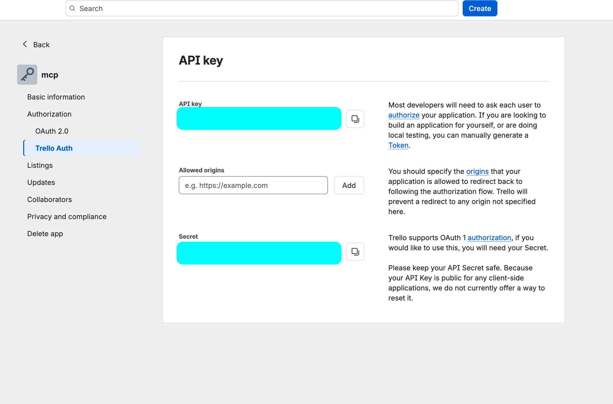

# Setup de agents

[← Volver al README](../../README.md)

## Configurar el MCP de Trello

Esta guía explica cómo conectar el servidor MCP de Trello
([`@delorenj/mcp-server-trello`](https://github.com/delorenj/mcp-server-trello))
a Claude Code para leer y modificar boards, listas y cards desde la terminal.

### Requisitos

- [Claude Code](https://claude.com/claude-code) instalado
- Node.js 18+ (para `npx`)
- Una cuenta de Trello

### 1. Crear el board en Trello

1. Entra a <https://trello.com> e inicia sesión.
2. Haz clic en **Create → Create board**.
3. Usa `AIPOS` como título del board y selecciona tu workspace.
4. Elige la visibilidad **Workspace** o **Private**. Evita **Public**: un board
   público puede verlo cualquier persona que tenga el enlace.
5. Haz clic en **Create**.

El nombre debe ser exactamente `AIPOS`, porque es el board que se usa en el
resto de esta guía para verificar la conexión.

### 2. Obtener el API key

1. Entra a <https://trello.com/power-ups/admin/>.
2. Haz clic en **New** para crear un Power-Up (el nombre es libre, por ejemplo `mcp`)
   y selecciona tu workspace.
3. Abre el Power-Up y ve a **Authorization → Trello Auth** (o la pestaña **API key**).
4. Si aún no existe, haz clic en **Generate a new API key**.
5. Copia el valor del campo **API key**.



> **Importante:** copia el campo **API key** (32 caracteres), no el campo **Secret**.
> El Secret no se usa en esta configuración y provoca un error `401 invalid key`
> si se usa como token.

### 3. Generar el token

1. En la misma pantalla, haz clic en el enlace **Token** que aparece en el texto
   a la derecha del API key.

   También puedes abrir esta URL directamente, reemplazando `TU_API_KEY`:

   ```
   https://trello.com/1/authorize?expiration=never&scope=read,write&response_type=token&name=AIPOS%20MCP&key=TU_API_KEY
   ```

2. Revisa los permisos y haz clic en **Allow**.
3. Copia el token que se muestra. Empieza con `ATTA`.

### 4. Agregar el servidor a Claude Code

El repositorio incluye una plantilla, `.mcp.json.example`, con los servidores MCP
del proyecto ya declarados. Desde la raíz del proyecto:

1. Copia la plantilla:

   ```bash
   cp .mcp.json.example .mcp.json
   ```

2. Abre `.mcp.json` y reemplaza los dos placeholders del servidor `trello` con
   los valores de los pasos 2 y 3:

   ```json
   "env": {
     "TRELLO_API_KEY": "tu-trello-api-key",
     "TRELLO_TOKEN": "tu-trello-token"
   }
   ```

   | Variable | Valor | Origen |
   |---|---|---|
   | `TRELLO_API_KEY` | 32 caracteres | Paso 2, campo **API key** |
   | `TRELLO_TOKEN` | Empieza con `ATTA` | Paso 3 |

3. Guarda el archivo. No hace falta ejecutar `claude mcp add`: Claude Code lee
   `.mcp.json` automáticamente al abrir el proyecto.

`.mcp.json` está en `.gitignore` porque contiene credenciales. Edita solo tu
copia: `.mcp.json.example` sí se versiona y debe conservar los placeholders.

#### Alternativa: Codex CLI

[Codex](https://github.com/openai/codex) también admite servidores MCP por
proyecto, mediante un archivo `.codex/config.toml` en la raíz del repositorio.
El flujo es el mismo que con Claude Code: copiar una plantilla y completar las
credenciales. Los pasos 1 a 3 no cambian.

1. Copia la plantilla:

   ```bash
   cp .codex/config.toml.example .codex/config.toml
   ```

2. Abre `.codex/config.toml` y reemplaza los dos placeholders:

   ```toml
   [mcp_servers.trello]
   command = "npx"
   args = ["-y", "@delorenj/mcp-server-trello"]

   [mcp_servers.trello.env]
   TRELLO_API_KEY = "tu-trello-api-key"
   TRELLO_TOKEN = "tu-trello-token"
   ```

3. Marca el proyecto como confiable. Codex solo carga la configuración de
   `.codex/` en proyectos de confianza. Tienes dos opciones:

   - Abre `codex` en la raíz del proyecto y acepta el aviso de confianza.
   - O agrega esta entrada a `~/.codex/config.toml`, con la ruta absoluta de tu
     copia del repositorio:

     ```toml
     [projects."/ruta/absoluta/a/AIPOS"]
     trust_level = "trusted"
     ```

4. Verifica desde la raíz del proyecto:

   ```bash
   codex mcp list        # trello debe aparecer con Status "enabled"
   codex mcp get trello
   ```

   Salida esperada de `codex mcp get trello`:

   ```
   trello
     enabled: true
     transport: stdio
     command: npx
     args: -y @delorenj/mcp-server-trello
     cwd: -
     env: TRELLO_API_KEY=*****, TRELLO_TOKEN=*****
   ```

5. Abre una sesión nueva de Codex en el proyecto y pide
   `lista mis boards de Trello`.

Notas:

- `.codex/config.toml` está en `.gitignore` porque contiene credenciales.
  `.codex/config.toml.example` sí se versiona y debe conservar los placeholders.
- No uses `codex mcp add` para este flujo: ese comando no tiene opción de
  alcance y siempre escribe en la configuración global (`~/.codex/config.toml`).
  La configuración por proyecto se crea editando el archivo.
- Si `trello` no aparece en `codex mcp list`, lo más probable es que el proyecto
  no esté marcado como confiable (paso 3) o que el comando se haya ejecutado
  fuera del repositorio.
- La columna `Auth` muestra `Unsupported`. Es normal en servidores stdio: se
  autentican con las variables de entorno, no con OAuth.

### 5. Verificar la conexión

1. Reinicia Claude Code, o ejecuta `/mcp` y reconecta el servidor `trello`.
2. Aprueba el servidor cuando Claude Code lo solicite.
3. Pide algo como `lista mis boards de Trello`. Deberías ver el board **AIPOS**.

### Solución de problemas

| Síntoma | Causa probable | Solución |
|---|---|---|
| `401 invalid key` | El API key o el token no son válidos. Suele pasar al pegar el **Secret** en lugar del token. | Repite los pasos 2 y 3 y verifica que el token empiece con `ATTA`. |
| `401 invalid token` | El token fue revocado o expiró. | Genera un token nuevo (paso 3). |
| El servidor sigue fallando tras corregir las credenciales | El proceso MCP aún usa los valores anteriores. | Reconecta desde `/mcp` o reinicia Claude Code. |
| El servidor `trello` no aparece | `.mcp.json` no existe, no está en la raíz del proyecto o tiene JSON inválido. | Repite el paso 4 y ejecuta `claude mcp list` desde la raíz. |

### Seguridad

- No subas el API key ni el token al repositorio. Usa siempre placeholders en la
  documentación y en los archivos de ejemplo.
- El token da acceso de lectura y escritura a todos tus boards. Si se expone,
  revócalo en <https://trello.com/my/account> → **Applications**.
