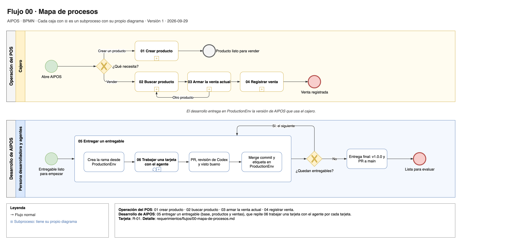

# Flujo 00 · Mapa de procesos

El mapa junta todos los flujos de AIPOS en un solo dibujo. Arriba está la operación del POS, lo que hace el
cajero. Abajo está el desarrollo de AIPOS, cómo se construye con el agente. Cada caja es un subproceso con su
propio diagrama.

Fuente editable: [`00-mapa-de-procesos.drawio`](../diagramas/00-mapa-de-procesos.drawio).

## Operación del POS

| Flujo | Qué hace el cajero | Sigue con |
|---|---|---|
| [01 Crear producto](01-crear-producto.md) | Crea un producto nuevo con nombre, precio y código de barras. | El producto ya se puede buscar. |
| [02 Buscar producto](02-buscar-producto.md) | Busca por nombre o por código de barras y elige un producto. | 03 |
| [03 Armar la venta actual](03-armar-la-venta-actual.md) | Agrega productos, edita el precio aplicado, cambia la cantidad, elimina y ve el total. | 02 para otro producto, o 04 |
| [04 Registrar venta](04-registrar-venta.md) | Registra la venta con `sp_registrar_venta`. | Una venta actual nueva y vacía. |

## Desarrollo de AIPOS

| Flujo | Qué pasa | Sigue con |
|---|---|---|
| [05 Entregar un entregable](05-entregar-un-entregable.md) | Rama, tarjetas, PR, revisión, merge commit y etiqueta en `ProductionEnv`. | El siguiente entregable o la entrega final. |
| [06 Trabajar una tarjeta con el agente](06-trabajar-una-tarjeta-con-el-agente.md) | Grafo del proyecto, requisitos y spec, implementación, pruebas, revisión contra la spec, revisión de la persona desarrolladora, bitácora y commit con el grafo al día. Se repite por cada tarjeta dentro del flujo 05. | 05 |

- **Requerimientos:** todos. La matriz está en el [README](../README.md#matriz-del-pdf).
- **Tarjetas:** R-01.
