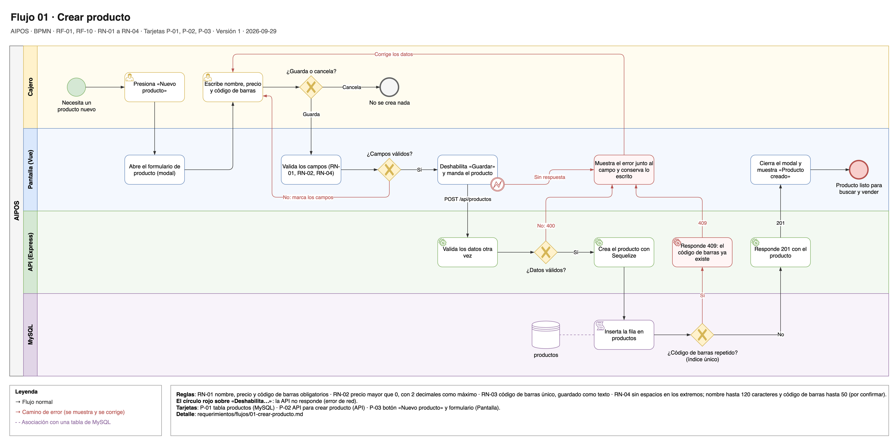

# Flujo 01 · Crear producto

El cajero crea un producto nuevo desde el botón "Nuevo producto". Si los datos están bien, el producto queda en
MySQL y ya se puede buscar y vender.

Fuente editable: [`01-crear-producto.drawio`](../diagramas/01-crear-producto.drawio).

- **Carriles:** Cajero · Pantalla (Vue) · API (Express) · MySQL.
- **Empieza:** el cajero necesita vender un producto que todavía no existe.
- **Termina bien:** el producto está en `productos` y sale al buscarlo.
- **Requerimientos:** [RF-01](../02-requerimientos-funcionales.md#rf-01-crear-producto),
  [RF-10](../02-requerimientos-funcionales.md#rf-10-guardar-productos-ventas-y-detalles-con-sus-relaciones);
  RN-01 a RN-04.
- **Tarjetas:** P-01 (tabla), P-02 (API), P-03 (pantalla).

## Pasos

1. **Cajero:** presiona "Nuevo producto".
2. **Pantalla:** abre el formulario de producto en un modal.
3. **Cajero:** escribe el nombre, el precio y el código de barras, y presiona "Guardar".
4. **Pantalla:** valida los campos (RN-01, RN-02, RN-04).
5. **Pantalla:** deshabilita "Guardar" y manda `POST /api/productos`.
6. **API:** valida los datos otra vez.
7. **API:** crea el producto con Sequelize.
8. **MySQL:** inserta la fila en `productos`. El índice único de `codigo_barras` impide que se repita (RN-03).
9. **API:** responde 201 con el producto creado.
10. **Pantalla:** cierra el modal y muestra "Producto creado".

## Otros caminos

| En el paso | Qué pasa | Resultado |
|---|---|---|
| 3 | El cajero presiona "Cancelar". | El modal se cierra y no se crea nada. |
| 4 | Falta un campo o el precio es inválido. | La pantalla marca el campo y no llama a la API. Vuelve al paso 3. |
| 6 | La API recibe datos inválidos, por ejemplo porque alguien la llamó sin la pantalla. | Responde 400 con el campo y el motivo. La pantalla lo muestra y vuelve al paso 3. |
| 8 | El código de barras ya existe. | MySQL rechaza la fila y la API responde 409. La pantalla muestra "Ya existe un producto con ese código de barras" junto al campo y conserva lo escrito. |
| 5 a 9 | La API no responde. | La pantalla avisa del error, conserva lo escrito y vuelve a habilitar "Guardar". |

## Notas técnicas

- El 409 sale del índice único de MySQL y no de una consulta previa. Si llegan dos peticiones iguales al mismo
  tiempo (dos pestañas o un doble clic), una consulta previa dejaría pasar las dos.
- `codigo_barras` es `VARCHAR`: un número perdería los ceros de la izquierda.
- mysql2 devuelve `precio` como texto ("25.00"). La pantalla lo convierte antes de sumar.
