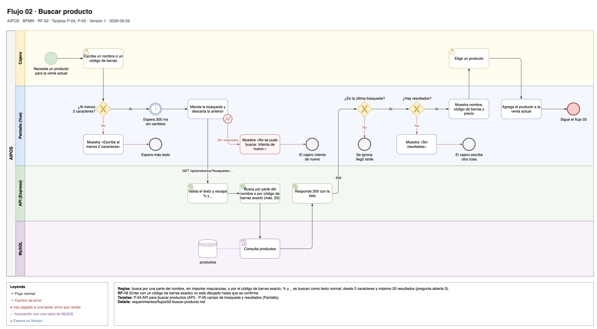

# Flujo 02 · Buscar producto

El cajero escribe un nombre o un código de barras en el campo de búsqueda, ve los productos que coinciden y
elige uno para la venta actual.

Fuente editable: [`02-buscar-producto.drawio`](../diagramas/02-buscar-producto.drawio).

- **Carriles:** Cajero · Pantalla (Vue) · API (Express) · MySQL.
- **Empieza:** el cajero necesita un producto para la venta actual.
- **Termina bien:** el producto elegido entra a la venta actual ([flujo 03](03-armar-la-venta-actual.md)).
- **Requerimientos:** [RF-02](../02-requerimientos-funcionales.md#rf-02-buscar-producto) y, si sobra tiempo,
  [RF-12](../02-requerimientos-funcionales.md#rf-12-agregar-con-un-código-de-barras-exacto) (pregunta abierta 5,
  resuelta el 2026-09-30).
- **Tarjetas:** P-04 (API), P-05 (pantalla).

## Pasos

1. **Cajero:** escribe en el campo de búsqueda un nombre o un código de barras.
2. **Pantalla:** revisa que haya al menos 2 caracteres.
3. **Pantalla:** espera 300 ms sin cambios, para no llamar a la API en cada tecla.
4. **Pantalla:** manda `GET /api/productos?busqueda=<texto>`.
5. **API:** valida el texto y escapa `%` y `_`.
6. **API:** busca por una parte del nombre, sin importar mayúsculas, o por el código de barras exacto. Pide 20
   resultados como máximo.
7. **MySQL:** consulta `productos`.
8. **API:** responde 200 con la lista.
9. **Pantalla:** revisa que la respuesta sea de la última búsqueda.
10. **Pantalla:** muestra los resultados con nombre, código de barras y precio.
11. **Cajero:** elige un producto.
12. **Pantalla:** lo agrega a la venta actual y sigue el flujo 03.

## Otros caminos

| En el paso | Qué pasa | Resultado |
|---|---|---|
| 2 | Hay menos de 2 caracteres. | No se busca. La pantalla muestra "Escribe al menos 2 caracteres". |
| 9 | La respuesta es de una búsqueda anterior (llegó tarde). | La pantalla la ignora. |
| 10 | No hay coincidencias. | La pantalla muestra "Sin resultados". |
| 4 a 8 | La API no responde. | La pantalla muestra "No se pudo buscar. Intenta de nuevo." |
| 1 | Opcional (RF-12, entra si sobra tiempo): el cajero escribe o escanea un código de barras completo y presiona Enter. | El producto entra directo a la venta actual. No está en el diagrama: manda el texto del flujo. |

## Notas técnicas

- Sin escapar `%` y `_`, buscar "50%" devolvería todos los productos que tengan "50" en el nombre.
- La consulta va con `replacements` de Sequelize, nunca con el texto pegado en el SQL.
