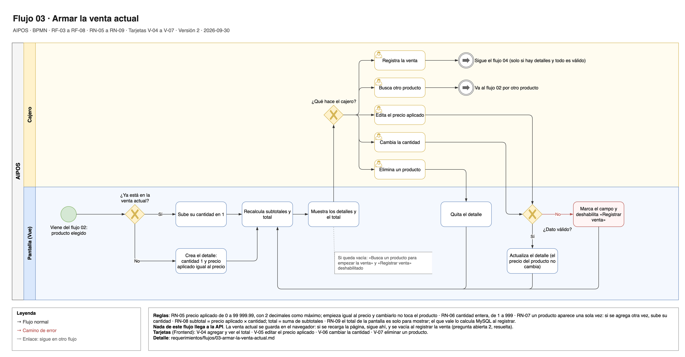

# Flujo 03 · Armar la venta actual

El cajero arma la venta actual en la pantalla: agrega productos, edita el precio aplicado, cambia la cantidad o
elimina un producto, y siempre ve el total. Nada llega a la API ni a MySQL hasta registrar la venta. La venta actual
se guarda en el navegador, así que sigue ahí si se recarga la página, y se vacía al registrar la venta.

Fuente editable: [`03-armar-la-venta-actual.drawio`](../diagramas/03-armar-la-venta-actual.drawio).

- **Carriles:** Cajero · Pantalla (Vue).
- **Empieza:** el cajero eligió un producto en la búsqueda ([flujo 02](02-buscar-producto.md)).
- **Termina:** el cajero presiona "Registrar venta" ([flujo 04](04-registrar-venta.md)).
- **Requerimientos:** [RF-03](../02-requerimientos-funcionales.md#rf-03-agregar-a-la-venta-actual) a
  [RF-08](../02-requerimientos-funcionales.md#rf-08-ver-el-total); RN-05 a RN-09.
- **Tarjetas:** V-04 (agregar y total), V-05 (precio aplicado), V-06 (cantidad), V-07 (eliminar).

## Pasos

1. **Pantalla:** revisa si el producto elegido ya está en la venta actual.
2. **Pantalla:** si ya está, sube su cantidad en 1. Si no, crea un detalle con cantidad 1 y con un precio
   aplicado igual al precio del producto.
3. **Pantalla:** recalcula los subtotales y el total, y muestra los detalles y el total.
4. **Cajero:** elige qué hacer:
   - **Buscar otro producto:** sigue el flujo 02 y vuelve al paso 1.
   - **Editar el precio aplicado:** la pantalla lo valida (de 0 a 99 999.99, 2 decimales como máximo) y actualiza el
     detalle. El precio del producto no cambia. Vuelve al paso 3.
   - **Cambiar la cantidad:** la pantalla la valida (entero, de 1 a 999) y actualiza el detalle. Vuelve al paso 3.
   - **Eliminar un producto:** la pantalla quita el detalle. Vuelve al paso 3.
   - **Registrar venta:** sigue el flujo 04.

## Otros caminos

| En el paso | Qué pasa | Resultado |
|---|---|---|
| 4 | El precio aplicado o la cantidad no son válidos. | La pantalla marca el campo y deshabilita "Registrar venta" hasta que se corrija. |
| 4 | El cajero elimina el último detalle. | La venta actual queda vacía: se ve "Busca un producto para empezar la venta" y "Registrar venta" queda deshabilitado. |
| Cualquiera | El cajero recarga la página. | La venta actual sigue igual: la pantalla la lee del navegador (pregunta abierta 2, resuelta el 2026-09-30). |
| Cualquiera | El navegador no deja guardar (por ejemplo, en una ventana privada). | La pantalla funciona igual, sin guardar la venta actual. |

## Notas técnicas

- La lógica de la venta actual (agregar, cantidad, precio aplicado, eliminar, total) vive fuera de los
  componentes, para probarla sin pantalla.
- La venta actual se guarda en `localStorage`, con `try/catch` en cada acceso, después de cada cambio. Se vacía cuando
  la API confirma la venta (flujo 04), no antes: si registrar falla, la venta actual se conserva.
- El total de la pantalla es solo para mostrar. El que vale lo calcula MySQL al registrar la venta (RN-09).
