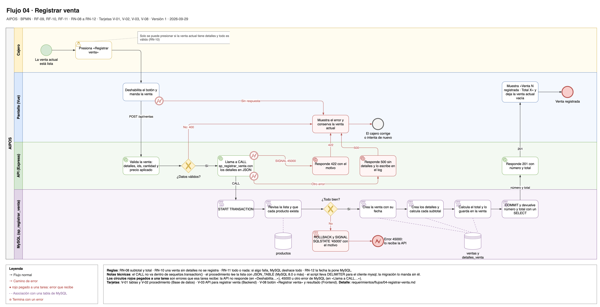

# Flujo 04 · Registrar venta

El cajero registra la venta actual. La API llama al procedimiento almacenado `sp_registrar_venta`, que guarda la
venta y todos sus detalles de una sola vez. Si algo falla, no se guarda nada y la venta actual sigue en la
pantalla.

Fuente editable: [`04-registrar-venta.drawio`](../diagramas/04-registrar-venta.drawio).

- **Carriles:** Cajero · Pantalla (Vue) · API (Express) · MySQL (`sp_registrar_venta`).
- **Empieza:** la venta actual tiene al menos un detalle y todos sus datos son válidos.
- **Termina bien:** la venta y sus detalles están en MySQL, y la venta actual queda vacía.
- **Requerimientos:** [RF-09](../02-requerimientos-funcionales.md#rf-09-registrar-venta),
  [RF-10](../02-requerimientos-funcionales.md#rf-10-guardar-productos-ventas-y-detalles-con-sus-relaciones),
  [RF-11](../02-requerimientos-funcionales.md#rf-11-registrar-venta-con-sp_registrar_venta); RN-08 a RN-12.
- **Tarjetas:** V-01 (tablas), V-02 (procedimiento), V-03 (API), V-08 (pantalla).

## Pasos

1. **Cajero:** presiona "Registrar venta".
2. **Pantalla:** deshabilita el botón, para que un doble clic no registre dos ventas, y manda `POST /api/ventas`
   con cada detalle: producto, cantidad y precio aplicado.
3. **API:** valida la venta: al menos un detalle, ids enteros, cantidad entera de 1 o más, precio aplicado de 0
   o más con 2 decimales como máximo y sin productos repetidos.
4. **API:** llama a `CALL sp_registrar_venta(:detalles)` con los detalles en JSON.
5. **MySQL:** empieza la operación con `START TRANSACTION`.
6. **MySQL:** revisa que la lista no esté vacía y que cada producto exista.
7. **MySQL:** crea la venta con su fecha.
8. **MySQL:** crea los detalles de venta y calcula cada subtotal.
9. **MySQL:** calcula el total y lo guarda en la venta.
10. **MySQL:** confirma con `COMMIT` y devuelve el número de la venta y el total con un `SELECT`.
11. **API:** responde 201 con el número de la venta y el total.
12. **Pantalla:** muestra "Venta N registrada · Total X" con los valores que devolvió MySQL y deja la venta
    actual vacía.

## Otros caminos

| En el paso | Qué pasa | Resultado |
|---|---|---|
| 1 | La venta actual está vacía o tiene un dato inválido. | "Registrar venta" está deshabilitado. |
| 3 | La API recibe datos inválidos. | Responde 400. La pantalla muestra el error, conserva la venta actual y habilita el botón otra vez. |
| 6 a 9 | Falla una regla: la lista está vacía o un producto no existe. | MySQL deshace todo con `ROLLBACK` y lanza `SIGNAL SQLSTATE '45000'` con el motivo. La API responde 422 y la pantalla muestra el motivo y conserva la venta actual. |
| 4 a 10 | Error inesperado de MySQL. | MySQL deshace todo. La API responde 500 sin detalles internos y lo escribe en el log. La pantalla avisa y conserva la venta actual. |
| 2 a 11 | La API no responde. | La pantalla avisa, conserva la venta actual y habilita el botón otra vez. |

## Notas técnicas

- El `CALL` no se envuelve en `sequelize.transaction()`: el `START TRANSACTION` del procedimiento haría
  `COMMIT` de lo que Sequelize tuviera abierto, sin avisar.
- El procedimiento devuelve el número y el total con un `SELECT` al final, no con parámetros `OUT`: Sequelize
  lee un `SELECT` directo.
- El procedimiento lee la lista con `JSON_TABLE`, que existe desde MySQL 8.0.
- El script SQL lleva `DELIMITER` para correrlo con el cliente `mysql`. La migración manda el cuerpo sin
  `DELIMITER`, porque Sequelize no lo entiende. Se prueban los dos caminos (tarjeta V-02).
