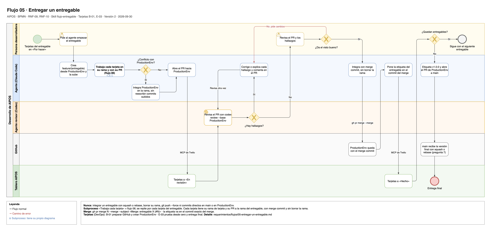

# Flujo 05 · Entregar un entregable

Cómo entra un entregable (base, productos o ventas) a `ProductionEnv`: una rama propia, sus tarjetas (cada una en su
rama de tarjeta y con su PR a la rama del entregable), un PR, la revisión del agente revisor, el visto bueno de la
persona desarrolladora, un merge commit y una etiqueta. Así, quien evalúa ve en el historial de git dónde empezó y
dónde se integró cada entregable y cada tarjeta. Sale de la skill
`flujo-entregable` del tile entrega-trazable.

Fuente editable: [`05-entregar-un-entregable.drawio`](../diagramas/05-entregar-un-entregable.drawio).

- **Carriles:** Persona desarrolladora · Agente (Claude Code) · Agente revisor (Codex) · GitHub · Tablero AIPOS.
- **Empieza:** las tarjetas del entregable están en "Por hacer".
- **Termina bien:** el entregable está en `ProductionEnv` con su merge commit y su etiqueta, y su rama sigue
  existiendo.
- **Requerimientos:** [RNF-09](../03-requerimientos-no-funcionales.md#rnf-09-git-y-github),
  [RNF-10](../03-requerimientos-no-funcionales.md#rnf-10-uso-del-agente).
- **Tarjetas:** B-01 (preparar GitHub), E-03 (entrega final) y todas las de cada entregable.

## Pasos

1. **Persona desarrolladora:** pide al agente empezar el entregable.
2. **Agente:** crea la rama `feature/<entregable>` desde `ProductionEnv` y la sube.
3. **Agente y persona desarrolladora:** trabajan cada tarjeta con el [flujo 06](06-trabajar-una-tarjeta-con-el-agente.md),
   hasta terminar las del entregable. Cada tarjeta tiene su propia rama de tarjeta, `<tipo>/<id>-<resumen>` en
   minúsculas (por ejemplo `feature/b-02-base-del-backend`), que sale de `feature/<entregable>`. Al terminar la
   tarjeta:
   - El agente pone la rama de tarjeta al día con `feature/<entregable>` en local y abre su PR hacia esa rama. La
     tarjeta pasa a "En revisión".
   - El agente revisor revisa el PR con `codex review --base origin/feature/<entregable>`, y el agente corrige cada
     hallazgo o anota por qué no aplica.
   - El agente integra el PR con merge commit, sin borrar la rama de tarjeta:
     `gh pr merge <numero> --merge --subject "Merge: <id> <resumen> (#<numero>)"`.
4. **Agente:** abre el PR hacia `ProductionEnv`.
5. **Tablero AIPOS:** las tarjetas del entregable siguen en "En revisión", y el PR del entregable enlaza los PR de sus tarjetas.
6. **Agente revisor:** revisa el PR con `codex review --base ProductionEnv`.
7. **Agente:** corrige cada hallazgo o anota por qué no aplica, y deja el resultado como comentario del PR.
8. **Persona desarrolladora:** revisa el PR y los hallazgos, y da el visto bueno.
9. **Agente:** pone la rama al día con `ProductionEnv` en local (`git merge origin/ProductionEnv`; si el merge se
   detiene porque el hook de git actualizó el grafo del proyecto, lo termina con `git commit --no-edit`) y la sube.
   Después integra con merge commit, sin borrar la rama:
   `gh pr merge <numero> --merge --subject "Merge: entregable <entregable> (#<numero>)"`.
10. **GitHub:** `ProductionEnv` queda con el merge commit.
11. **Agente:** pone la etiqueta `entregable-<entregable>` en el commit del merge y la sube.
12. **Tablero AIPOS:** las tarjetas pasan a "Hecho".
13. Si quedan entregables, se repite desde el paso 1 con el siguiente. Si no, sigue la entrega final.

## Entrega final

1. **Agente:** pone la etiqueta `v1.0.0`, pone `ProductionEnv` al día con `main` en local, como en el paso 9, y abre
   el PR de `ProductionEnv` a `main`.
2. **GitHub:** la regla "Protect main" solo deja integrar con squash o rebase (pregunta abierta 7).
3. No se borran `ProductionEnv` ni las ramas de entregable.

## Otros caminos

| En el paso | Qué pasa | Resultado |
|---|---|---|
| 3 | `feature/<entregable>` cambió mientras se trabajaba la tarjeta. | El agente integra `feature/<entregable>` en la rama de tarjeta antes del PR, sin reescribir commits ya subidos. |
| 4 | `ProductionEnv` cambió y hay conflicto con la rama. | El agente integra `ProductionEnv` en la rama y resuelve el conflicto, sin reescribir commits ya subidos. |
| 6 | El agente revisor no encuentra nada. | Sigue el paso 8. |
| 7 | Los cambios por un hallazgo tocan código. | Vuelve al paso 6 para revisar otra vez. |
| 8 | La persona desarrolladora pide cambios. | El agente los hace con el flujo 06 y vuelve al paso 6. |

## Qué no se hace

- Integrar con squash o rebase: se pierde la separación entre entregables y entre tarjetas.
- Borrar la rama de un entregable o la rama de una tarjeta.
- `git push --force` o reescribir commits que ya se subieron.
- Commits directos en `main` o en `ProductionEnv`.
