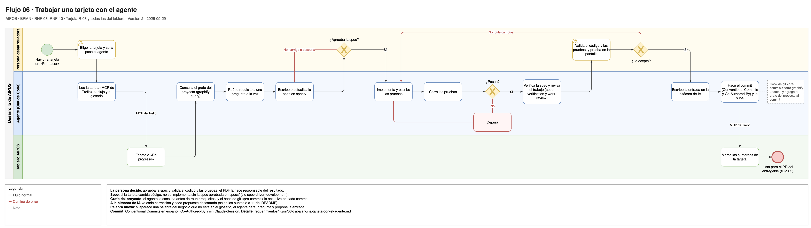

# Flujo 06 · Trabajar una tarjeta con el agente

Cómo se hace una tarjeta del tablero AIPOS con el agente. El agente propone, implementa y prueba; la persona
desarrolladora decide, valida y aprueba. Cada corrección y cada propuesta descartada queda en la bitácora de IA,
porque de ahí salen los puntos 8 a 11 del README.

Fuente editable: [`06-trabajar-una-tarjeta-con-el-agente.drawio`](../diagramas/06-trabajar-una-tarjeta-con-el-agente.drawio).

- **Carriles:** Persona desarrolladora · Agente (Claude Code) · Tablero AIPOS.
- **Empieza:** hay una tarjeta en "Por hacer".
- **Termina bien:** el cambio está en un commit con su entrada en la bitácora y el grafo del proyecto al día, y
  la tarjeta está lista para el PR de su entregable ([flujo 05](05-entregar-un-entregable.md)).
- **Requerimientos:** [RNF-08](../03-requerimientos-no-funcionales.md#rnf-08-pruebas),
  [RNF-10](../03-requerimientos-no-funcionales.md#rnf-10-uso-del-agente).
- **Tarjetas:** R-03 (definición de terminado) y todas las del tablero.
- **Tiles:** `spec-driven-development` pide la spec aprobada antes del código, y `grafo-del-proyecto` pide
  consultar el grafo del proyecto antes de empezar. La guía del grafo está en
  [docs/setup/graphify-setup.md](../../docs/setup/graphify-setup.md).

## Pasos

1. **Persona desarrolladora:** elige la tarjeta y se la pasa al agente.
2. **Agente:** lee la tarjeta con el MCP de Trello, su flujo en `requerimientos/` y el glosario.
3. **Tablero AIPOS:** la tarjeta pasa a "En progreso".
4. **Agente:** consulta el grafo del proyecto con `graphify query`, para ubicar el código, las specs y los
   documentos que toca la tarjeta.
5. **Agente:** reúne requisitos con la persona desarrolladora, una pregunta a la vez (skill `requirement-gathering`).
6. **Agente:** escribe o actualiza la spec en `specs/` (skill `spec-writer`).
7. **Persona desarrolladora:** aprueba la spec.
8. **Agente:** implementa y escribe las pruebas.
9. **Agente:** corre las pruebas.
10. **Agente:** verifica la spec y revisa el trabajo contra ella (skills `spec-verification` y `work-review`).
11. **Persona desarrolladora:** valida el código y las pruebas, y lo prueba en la pantalla.
12. **Agente:** escribe la entrada en la bitácora de IA.
13. **Agente:** hace el commit con Conventional Commits y `Co-Authored-By`, sin `Claude-Session`, y lo sube. El
    hook de git `pre-commit` actualiza el grafo del proyecto y lo agrega al commit.
14. **Tablero AIPOS:** se marcan las subtareas de la tarjeta.

## Otros caminos

| En el paso | Qué pasa | Resultado |
|---|---|---|
| 4 | El comando `graphify` no está instalado. | El agente lee `graphify-out/GRAPH_REPORT.md` y le pregunta a la persona desarrolladora si instala Graphify. Sigue en el paso 5. |
| 5 a 7 | La tarjeta no cambia código, por ejemplo una de documentación. | No lleva spec: el agente propone un plan corto y la persona desarrolladora lo aprueba. Sigue en el paso 8. |
| 7 | La persona desarrolladora corrige o descarta la spec. | Queda anotado para la bitácora. El agente ajusta la spec y vuelve al paso 6. |
| 5 a 8 | Aparece una palabra del negocio que no está en el glosario. | El agente para, le pregunta a la persona desarrolladora y propone la entrada. Sigue cuando está en el glosario. |
| 9 | Una prueba falla. | El agente depura y vuelve al paso 8. |
| 10 | El código no cumple la spec, o la spec quedó vieja. | El agente corrige el código o actualiza la spec y vuelve al paso 9. Si cambió la spec, la persona desarrolladora la vuelve a aprobar. |
| 11 | La persona desarrolladora pide cambios. | Queda anotado para la bitácora y vuelve al paso 8. |
| 13 | El hook de git no está activo. | El agente corre `git config core.hooksPath .githooks`. Si no puede, corre `graphify update .` y agrega el grafo del proyecto al commit a mano. |
