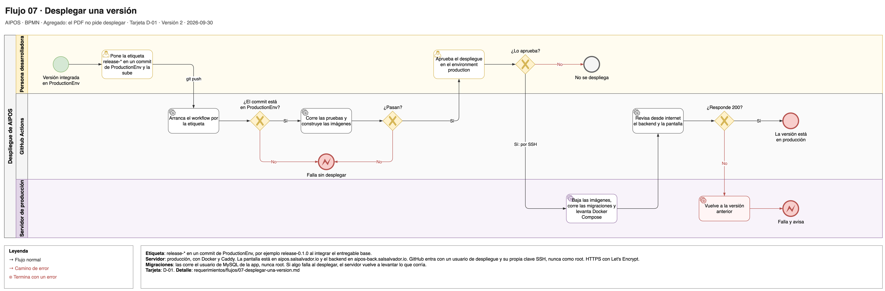

# Flujo 07 · Desplegar una versión

Cómo llega AIPOS a producción, el servidor real donde se usa. La persona desarrolladora sube una etiqueta `release-*`.
El pipeline (la cadena de pasos automáticos de GitHub Actions) revisa la etiqueta, prueba el backend y la pantalla,
construye las dos imágenes de Docker y se detiene hasta que ella aprueba. Después despliega por SSH en el servidor,
revisa desde internet y, si algo falla, vuelve a la versión anterior. Es un agregado: el PDF no pide desplegar (ver
«Lo que agregamos» en [01-alcance.md](../01-alcance.md)).

Fuente editable: [`07-desplegar-una-version.drawio`](../diagramas/07-desplegar-una-version.drawio).

- **Carriles:** Persona desarrolladora · GitHub Actions · Servidor de producción.
- **Empieza:** un entregable está integrado en `ProductionEnv` ([flujo 05](05-entregar-un-entregable.md)).
- **Termina bien:** la versión corre en producción: `https://aipos.salsalvador.io` (la pantalla) y
  `https://aipos-back.salsalvador.io/api/salud` (el backend) responden 200, y el servidor guarda `version-actual` y
  `version-anterior`.
- **Requerimientos:** ninguno del PDF. Se apoya en [RNF-04](../03-requerimientos-no-funcionales.md#rnf-04-seguridad-básica)
  (credenciales fuera de git y CORS solo para la pantalla) y en [RNF-09](../03-requerimientos-no-funcionales.md#rnf-09-git-y-github).
- **Tarjetas:** D-01. Las etiquetas las sube la persona desarrolladora: `release-0.1.0` con el entregable base,
  `release-0.2.0` con productos y `release-1.0.0` con ventas.
- **Spec y guía:** [`specs/despliegue.spec.md`](../../specs/despliegue.spec.md) y [`docs/despliegue.md`](../../docs/despliegue.md).

## Pasos

1. **Persona desarrolladora:** pone la etiqueta `release-MAYOR.MENOR.PARCHE` en un commit de `ProductionEnv` y la sube
   con `git push`.
2. **GitHub Actions:** arranca el workflow `despliegue.yml` con la etiqueta.
3. **GitHub Actions, job `revisar`:** comprueba que la etiqueta tenga la forma exacta y que su commit esté en
   `ProductionEnv`. Si no, falla sin desplegar.
4. **GitHub Actions, jobs `probar-backend` y `probar-frontend`:** corren `npm test` del backend (con un MySQL 8.4) y de
   la pantalla. Si algo falla, no se despliega nada.
5. **GitHub Actions, job `construir`:** construye las imágenes del backend y de la pantalla y las sube a `ghcr.io`
   (el registro de imágenes de GitHub) con la etiqueta.
6. **Persona desarrolladora:** aprueba el despliegue en el environment `production` de GitHub. Si lo rechaza, no se
   despliega nada.
7. **GitHub Actions, job `desplegar`:** entra por SSH al servidor con el usuario de despliegue, copia el compose y el
   script de esa versión, y entra a `ghcr.io` con el token del propio job.
8. **Servidor:** `desplegar.sh desplegar` toma un candado, baja las imágenes, levanta MySQL, corre las migraciones con el
   usuario de la app, levanta el backend y la pantalla y comprueba que respondan en `127.0.0.1`. Si algo falla aquí, el
   mismo script deja corriendo lo que ya corría.
9. **GitHub Actions:** `revisar-produccion.sh` revisa desde internet el backend, la pantalla, `/api/docs` y el CORS.
10. **GitHub Actions:** si esa revisión falla, corre `desplegar.sh volver` y el job queda en rojo.
11. **GitHub Actions:** sale de `ghcr.io` en el servidor y borra la clave. La versión está en producción.

## Otros caminos

| En el paso | Qué pasa | Resultado |
|---|---|---|
| 3 | La etiqueta no tiene la forma `release-X.Y.Z`, o su commit no está en `ProductionEnv`. | `revisar` falla con el nombre de la etiqueta. Nada cambia. |
| 4 | Falla una prueba. | El job de pruebas en rojo; `construir` y `desplegar` no corren. |
| 6 | La persona rechaza la aprobación o no aprueba a tiempo. | `desplegar` cancelado o vencido. Las imágenes quedan en `ghcr.io` sin usarse. |
| 8 | No se puede bajar una imagen. | El script termina antes de tocar nada. Sigue la versión anterior. |
| 8 | Falla una migración. | Sigue la versión anterior, y el mensaje avisa que hay que revisar la base: MySQL no deshace los cambios de esquema. |
| 8 | El backend o la pantalla nuevos no quedan sanos. | El script vuelve a levantar la versión que corría y termina con error. |
| 8 | Es el primer despliegue y falla. | Backend y pantalla detenidos; MySQL y sus datos siguen. |
| 9 | Falla la revisión desde internet (certificado, DNS, CORS). | Paso 10: vuelve a `version-anterior`. |
| 8 | Ya hay un despliegue corriendo. | El segundo espera en fila; si chocan en el servidor, el segundo falla por el candado. |

Para volver a mano, la persona desarrolladora corre otra vez el workflow de una etiqueta anterior (**Re-run all jobs**),
y la aprueba de nuevo.

## Qué no se hace

- Desplegar una rama o `main`: solo despliega una etiqueta `release-*`. Las etiquetas `entregable-<x>` y `v1.0.0` no
  arrancan el workflow.
- Aprobar un despliegue por la persona desarrolladora: la aprobación es suya, en la página de la ejecución.
- `docker compose down -v` o cualquier orden que borre el volumen de MySQL: son los datos de producción.
- Reiniciar Caddy o tocar el archivo de otro sitio: se recarga con `systemctl reload caddy`.
- Escribir una dirección IP, el alias de acceso al servidor, un usuario del sistema o una credencial en git, en el
  tablero o en un commit.
